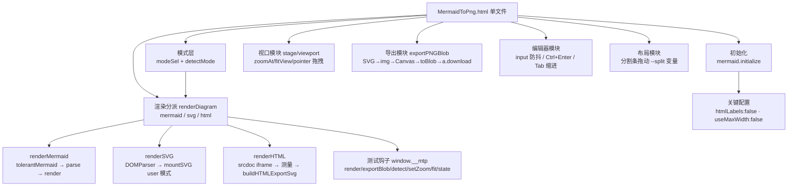
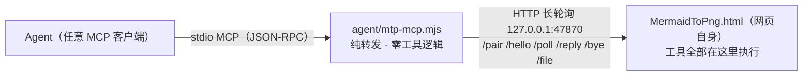
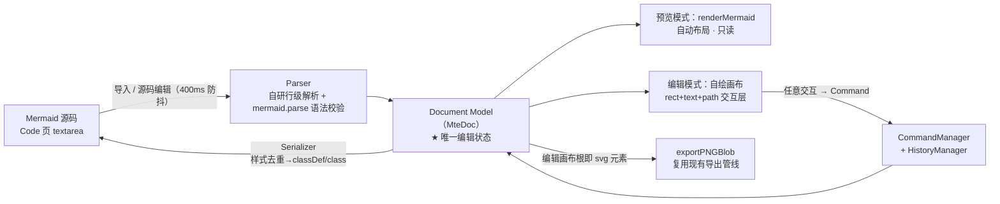

# MermaidToPng 项目架构

> 单文件本地 Mermaid / SVG / HTML → PNG 工具。粘贴代码 → 实时预览→ 导出高清 PNG。
> 状态：**已实现并实测通过**
> 入口：`MermaidToPng.html` 双击即用；线上版 **http://www.jjmermaid.xin**。
> Agent 接口层 v2（桥模式：工具全部在网页里执行，MCP 桥纯转发 + `/file` 落盘）：架构见 §8，**已实现并实测通过**（v1 CDP 无头方案曾实现并验证，按 §8.0 的理由替换移除）。
> 编辑层 v3（§9：「进入编辑」→ 组件拖拽 / 改文字 / 改样式 → 所见即所得 → 回写源码）：**已实现并实测通过**。测试钩子 `window.__mtpEdit`（§9.7）；回归脚本在 `.tmp_verify/run_verify.py`（gitignore，本地跑）。

## 1. 需求 → 设计映射

| 需求 | 实现 |
|---|---|
| 粘贴代码到 Code 页，预览页渲染 | 左右分栏布局；`textarea#code` 输入 400ms 防抖后 `renderDiagram()`；Ctrl+Enter 立即渲染 |
| 三语法支持（Mermaid / SVG / HTML） | `renderDiagram` 按 `state.mode` 分派到 `renderMermaid / renderSVG / renderHTML`；模式来自 `#modeSel`（自动检测/手动），自动检测 `detectMode()`：剥前导注释/XML 声明/DOCTYPE 后，`<svg` 开头 → svg，其余 `<` 开头 → html，否则 mermaid（Mermaid 代码不以 `<` 开头） |
| SVG 输入渲染与导出 | `DOMParser('image/svg+xml')` 解析（parsererror 检测）→ 序列化挂载 `mountSVG(svg, true)`（保留根节点非尺寸样式）；测得自然尺寸后回写根 `width/height` 存入 `lastRawSvg`，走与 Mermaid 完全相同的导出管线 |
| HTML 输入渲染 | `renderHTML`：srcdoc iframe 挂载（片段自动包装成最小文档 + inline-block 包裹层）；`pointer-events:none` 让缩放/拖拽事件穿透到 stage；尺寸自动测量（见下） |
| HTML 尺寸测量 | 片段：包裹元素 `getBoundingClientRect`（收缩到内容）；完整文档：`body.getBoundingClientRect` 优先（尊重显式宽高），仅当内容真溢出容器（scroll > client）才扩展；工作宽 900px，溢出放宽上限 3840，高度按内容实测 |
| HTML 导出 | `buildHTMLExportSvg`：克隆 `documentElement` 包进 `<foreignObject>`（width/height=实测尺寸）→ `lastRawSvg` → 与 Mermaid 相同的 SVG→img→Canvas 管线；iframe 中 `<script>` 已执行，克隆的是最终 DOM |
| 预览图可缩放、拖拽 | `#stage`（overflow:hidden 视口）+ `#viewport`（CSS `translate+scale`，origin 左上）；滚轮以鼠标位置为不动点缩放；Pointer Events 拖拽；按钮适应窗口（「适应」「1:1」；2026-10-08 起移除双击适应——双击在编辑模式承担改文字，画布双击易误触） |
| 下载 PNG 且可选位置 | SVG → `data:image/svg+xml` → `` → Canvas（倍率缩放）→ `toBlob` → `<a download>` 触发浏览器另存为对话框（用户自选位置） |
| 导出背景色 | `input[type=color]` 底色选择器，Canvas `fillRect` 填色；透明底勾选优先并联动置灰；选择存 localStorage |
| 所见即所得背景 | 预览画布背景实时同步所选底色（`syncStageBg`，改色/透明/启动三处触发）；透明底时预览显示棋盘格占位，导出 PNG 为真透明 |
| Mermaid 语法参考 | 内置 mermaid v11.4.1 官方 UMD（内联进主文件，离线可用），支持全部官方图型与语法 |

## 2. 形态选型（为什么是单文件 HTML）

| 方案 | 体积 | 依赖 | 保存位置对话框 | 结论 |
|---|---|---|---|---|
| **单文件 HTML** ✅ | ~2.8MB（主要是 mermaid.js，2026-10 实测 2.77MB） | 无（双击即用） | 浏览器原生另存为 | 采纳 |
| mermaid-live-editor（官方） | 整套 SvelteKit 工具链 | pnpm/Docker | 浏览器另存为 | 功能全但过重，且仅 SVG 导出一等公民 |
| Electron | ~150MB 打包 | Node + 打包链 | 原生对话框 | 杀鸡用牛刀 |
| Tauri | ~10MB | Rust 工具链 | 原生对话框 | 需 Rust，维护成本高 |

零安装、离线可用、`file://` 直开，浏览器下载天然弹"保存位置"。

## 3. 技术栈

- **渲染引擎**：mermaid v11.4.1（UMD，内联进主文件，无网络依赖）+ 浏览器原生 SVG/HTML 渲染
- **UI**：原生 HTML/CSS/JS（零框架、零构建）；深色赛博主题（霓虹紫/青、毛玻璃卡片）
- **导出管线**：浏览器原生 Canvas 2D + `toBlob('image/png')`（三语法共用同一条管线）
- **持久化**：`localStorage`（代码、语法模式、分栏比例、倍率、透明底偏好）

## 4. 模块结构（单文件内）



| 模块 | 核心函数 | 要点 |
|---|---|---|
| 初始化 | `mermaid.initialize` | `flowchart.htmlLabels:false` —— 否则 SVG 经 `` 转 Canvas 时 foreignObject 被禁，导出全空白（本项目最关键的一个坑）；`useMaxWidth:false` 固定自然尺寸 |
| 模式层 | `detectMode / modeOf` | 自动检测只看首个有效标记（剥注释/XML 声明/DOCTYPE）；手动选择存 `mtp.mode` |
| 渲染分派 | `renderDiagram()` | 三个分支成功后都保证 `state.lastRawSvg`（导出源）与 `state.vbW/vbH`（自然尺寸）就位；失败不覆盖旧图 |
| Mermaid 分支 | `renderMermaid` | `tolerantMermaid` 容错（形状标签补引号、note 语句改写）→ `parse` 预检 → `render` |
| SVG 分支 | `renderSVG` | parsererror 检测并显示；挂载保留用户根样式（只剥尺寸键）；导出源回写显式 width/height |
| SVG 挂载 | `mountSVG` | **XML 解析 + importNode 优先**，非严格 XML 才回退 innerHTML——HTML 解析器在 SVG 上下文遇 `<br/>` 等 breakout 标签会截断 SVG（实测 4440 字符源码只挂上 1261 字符，其后元素全部丢失）；尺寸优先级：显式像素宽高 → viewBox → getBBox |
| HTML 分支 | `renderHTML / buildHTMLExportSvg` | srcdoc iframe 预览（`pointer-events:none` 穿透交互）；尺寸自动测量（工作宽 900/溢出放宽/文档尊重显式尺寸）；导出=克隆文档包 foreignObject |
| 视口 | `zoomAt/fitView` | 变换 = `translate(tx,ty) scale(s)`；滚轮不动点公式 `tx' = mx-(mx-tx)k`；新图渲染后自动适应窗口 |
| 导出 | `exportPNGBlob(mult, transparent, bgColor)` | 1×/2×/3× 倍率；Canvas 上限保护（单边 16384 / 总像素 2^28，超限自动降倍率）；超长内容 data:URL 自动降级 blob:URL；文件名前缀按模式 `mermaid-/svg-/html-` |
| 编辑器 | 事件层 | 400ms 防抖实时渲染；localStorage 自动保存；Tab 插入两空格 |
| 外观模块 | `applyAppearance / extractDominant / loadBgFile` | 上传图片压缩（最长边 1920 JPEG85%）设为 `#bgLayer`（fixed，z-index:-1）背景；四参数（填充 object-fit / 缩放 transform scale / 模糊 filter blur / 遮罩独立 `#bgMask` 层）实时应用；48×48 桶量化 + 饱和度加权提取主色写 `--dominant`（三个主标题着色，过暗自动提亮）；`body.has-bg` 启用玻璃模糊（header/card-h：backdrop blur 18px + saturate 1.5 + 高光顶边）与其余文字 `mix-blend-mode:difference`；外观含 dataURL 整体持久化 `mtp.appearance` |
| 测试钩子 | `window.__mtp` | 自动化验证入口：`render / exportBlob / detect / setZoom / fit / state` |

## 5. 文件清单

```
MermaidToPng/
├── MermaidToPng.html    # 全部应用代码 + 内联 mermaid 库（~2.8MB，双击即用）
│                        #   v2：+ Agent 按钮（header「外观」左侧）/ 右上角配对面板 / 桥客户端 / mtp_render·mtp_detect 工具实现（§8.3，页面内增量）
│                        #   v3：+ 编辑层（§9）：header「进入编辑⇄退出编辑/撤销/重做/导入/保存」、左栏「源码|编辑」双 Tab + 分组编辑栏、
│                        #        自绘 SVG 交互层（拖拽/8 向 resize/双击改文字/快捷键）、window.__mtpEdit 钩子、.mte sidecar
├── agent/
│   ├── mtp-mcp.mjs      # v2 MCP 桥（§8.2，已实现）：纯转发 + /file 落盘，零依赖 Node 18+
│   └── README.md        # Agent 接口层使用说明（注册 / 自测 / 排障）
├── deploy/index.html    # 部署副本（与主文件逐字节同步；网页版连同一个本地桥）
├── mermaid.min.js       # mermaid v11.4.1 官方 UMD（2.57MB，升级库用）
├── MermaidToPng.bat     # 双击用默认浏览器打开主文件
├── fetch_mermaid.py     # 升级 mermaid 库（npmmirror 直连 + 代理回退）
├── README.md            # 面向使用者的快速上手
├── ARCHITECTURE.md      # 本文档
└── .gitignore
```


### 可移植性

- 单文件即全部：拷 `MermaidToPng.html` 一个文件到任何电脑双击即用（Agent 接口是可选增强，没有桥与配对也不影响手工使用）。
- 修改主文件后需同步 `deploy/index.html`（逐字节拷贝）。

## 6. 已验证清单

| 项 | 结果 |
|---|---|
| eval Promise 支持 / 页面加载 | ✅ |
| 语法自动检测 9 组输入（mermaid×3 / svg×3 / html×3，含 %%指令、XML 声明、注释、DOCTYPE 前缀） | ✅ |
| Mermaid 回归：渲染 graph TD（108×174）、lastRawSvg 就位 | ✅ |
| SVG 渲染 420×180、导出源写入显式尺寸 | ✅ |
| SVG 导出 2×：PNG magic、840×360、角落=[255,255,255,255]、中心=[124,58,237,255]（紫） | ✅ |
| HTML 片段渲染：iframe 挂载、实测尺寸 242×103、导出源含 foreignObject | ✅ |
| HTML 导出 2×：PNG magic、中心=渐变色非白 | ✅ |
| HTML 内嵌 `<script>` 执行，结果文本进入导出串 | ✅ |
| 完整文档（显式 300×120 + 背景 #123456）：按自身尺寸渲染，背景随导出保留（角落=[18,52,86,255]） | ✅ |
| 坏 SVG：报错显示、旧图 lastRawSvg 不被覆盖 | ✅ |
| Mermaid 重渲染 + setZoom(1.5) transform 正确 | ✅ |
| 三模式截图目检（Mermaid 流程图 / SVG 卡片 / HTML 渐变卡片） | ✅ |
| **修复回归**：含 `<br/>` 的复杂 SVG（校园门禁架构图 900×650）完整渲染——rect 2→16、text 22、path 3，导出 2× 像素色值与源码色板吻合（#fff2cc/#fff4e6），与参考图一致 | ✅ |
| **修复回归**：Mermaid / 常规 SVG / HTML 三路挂载路径不受影响 | ✅ |
| 外观系统：主色提取（橙图 → rgb(230,127,34) 精确命中）、logo/tag 主色着色、玻璃 backdrop blur(18px) saturate(1.5)、按钮/textarea/dim 差值混合、参数（zoom 150/blur 8/mask 40/contain）实时生效、localStorage 持久化与刷新恢复、移除背景还原默认 | ✅ |

历史版本（Edge 153 + CDP）验证过的基础能力——滚轮缩放、拖拽、透明底导出（角落 [0,0,0,0]）、3× 倍率、PNG magic 落盘——本次未改动该部分逻辑，继续有效。

## 7. 已知限制

- **保存位置对话框**：Edge/Chrome 需在设置里开启"每次下载前询问保存位置"才弹位置选择；Firefox 默认弹窗。这是浏览器安全模型，网页无法绕过。
- **HTML 模式外部资源**：导出管线（data:URL SVG）不加载外部图片/CSS/字体——图片用 base64 data URL 内联，样式写 `<style>`/`style` 属性。预览 iframe 同样受 file:// 限制。
- **HTML 模式脚本执行**：预览与导出数据构建会执行粘贴 HTML 中的 `<script>`（导出截取执行后 DOM），只应粘贴可信内容。
- **HTML 无固有尺寸**：宽度默认工作宽 900px（内容溢出自动放宽至上限 3840px），高度按内容实测；`100vh` 类文档按初始工作高 800px 计算。
- **序列图等图型**：`sequence` 等内部可能仍用 foreignObject 渲染文本，若个别图型导出空白，属 mermaid 上游行为。

## 8. Agent 接口层 v2：桥模式
> 目标：任意 Agent（任何支持 MCP 的客户端）在会话内直接「图表源码 → PNG 落盘」。**工具全部在网页里执行**，本地只有一个纯转发的 MCP 桥。
>技术参考：https://lumisynth.cielaniska.top/
```
Agent ──stdio MCP──▶ mtp-mcp.mjs ──HTTP长轮询(127.0.0.1)──▶ 网页自身
              （纯转发，零工具逻辑）                    （工具全部在这执行）
```

### 8.1 总体架构



一次 `mtp_render` 的数据流：

1. Agent 经 stdio 发 `tools/call mtp_render`，桥入队（`forward()`）
2. 页面长轮询 `/poll` 领到任务 → 在页面里执行工具：`detectMode → renderDiagram → exportPNGBlob`（复用现有管线，零新渲染逻辑）→ blob→base64
3. 页面 `POST /file` 让桥把 base64 写入目标路径（根目录沙箱，§8.4）
4. 页面 `POST /reply` 回传**小结果** `{ok, path, width, height, bytes…}`，桥 resolve 给 Agent
5. PNG 字节全程不进 Agent 上下文

### 8.2 桥 `agent/mtp-mcp.mjs`

零依赖单文件，Node 18+，无任何 npm 依赖。三个要点：品牌字段（`serverInfo.name='mermaid-to-png'`、`mtp_connect` 工具文案、instructions）、默认端口 **47870**、通用 `/file` 落盘端点（§8.4）。

| 端点 | 方法 | 作用 |
|---|---|---|
| `/status` | GET | `{name, version, paired, port}`；**非浏览器请求**（无 Origin / Sec-Fetch-Site）额外返回 `code`，Agent 一条 curl 即可取配对码，浏览器 fetch 拿不到（防恶意网页自动配对） |
| `/pair` | POST | 页面提交 6 位配对码 → 发 Bearer token；新配对踢旧页并换新码 |
| `/hello` | POST | 页面上报工具清单 → 桥发 `tools/list_changed` 通知 Agent |
| `/poll` | GET | 长轮询领任务（25s 空转返回 204；同刻只保留一个长轮询） |
| `/reply` | POST | 页面回传工具结果，resolve 对应 pending 调用 |
| `/file` | POST | base64 → 磁盘文件（沙箱限 `--root`，§8.4） |
| `/bye` | POST | 页面主动断开 |

- MCP 侧（stdio）：`initialize`（instructions 引导 Agent 未连接先调 `mtp_connect`）、`ping`、`tools/list` = [`mtp_connect`（桥内置，返回配对码与端口）] + 页面工具、`tools/call` → `forward()` 入队等 `/reply`；prompts 透传（本项目的页面上报为空）
- 连接管理：页面 45s 无心跳即断开并换新配对码、清空 pending；桥进程生命周期归 Agent（stdio 父进程），**无服务注册、无端口常驻、无僵尸进程问题**
- CORS/预检：回显 Origin（或 `null`）+ `Access-Control-Allow-Private-Network: true`（Chrome 从 https/file 页面访问 127.0.0.1 的 PNA 预检）——file:// 本地页与线上 https 页均可连
- 启动参数：`--port` / `--root`（可多次）/ `--code <6位>`（固定配对码，重启不换）/ `--keep`（stdin 关闭不退出——未注册 MCP 的客户端用终端手动拉桥时必带，否则桥随 shell 关闭静默死亡）
- 丝滑路径：Agent 把 `http://www.jjmermaid.xin/?mtp=<端口>:<配对码>` 发给用户，页面读参自动填面板并连接
- 常量实测值：POLL_WAIT 25s / PAGE_TIMEOUT 45s / CALL_TIMEOUT 30min / 请求体上限 64MB

### 8.3 页面侧

| 部件 | 说明 |
|---|---|
| Agent 面板 | header「外观」左侧的「Agent」按钮展开（右上角弹出）：端口 + 配对码 + 「连接/断开」+ 状态；默认收起，不干扰手工使用 |
| 桥客户端 | `pair → hello(工具清单) → poll 循环 → 执行 → reply`；断线**静默退避重试**（绝不弹窗）；`beforeunload` 尽力发 `/bye` |
| 工具实现 | 全在页面，直接调现有函数 |

页面上报的工具（经 `/hello` 动态注册，Agent 的 `tools/list` 即时可见）：

| 工具 | 入参 | 返回（小信封，<4KB） |
|---|---|---|
| `mtp_render` | `code`(必填) / `output_path`(必填，相对路径=拼根目录) / `mode='auto'` / `scale=2`(1–3) / `transparent=false` / `background='#ffffff'` | 成功 `{ok:true, mode, width, height, bytes, path, elapsed_ms, warnings[]}`；失败 `isError` + `{ok:false, stage, message, detail}`（`stage`∈`detect/render/export/file`，`detail` 带 mermaid parser 原始报错，供 Agent 转述排错） |
| `mtp_detect` | `code` | `{mode}`——纯 `detectMode` 包装，不渲染，供 Agent 预检语法 |

工具内核复用 v1 已验证的 `__mtpAgent.render` 逻辑（detect / render / export + HTML 分支 pending 轮询 ≤15s + Canvas 超限自动降倍率进 `warnings`），唯一差异：末步从「返回 base64」改为「`/file` 落盘后返回路径」。`window.__mtp` 测试钩子不动。

### 8.4 `/file`：大二进制落盘

**为什么不走工具结果回 base64**：2× PNG 常见 0.1–2MB，base64 后 0.13–2.7MB 字符直灌 Agent 上下文（数万~数十万 token），不可接受。落盘后工具结果 <1KB。

```
POST /file   (Authorization: Bearer <token>)
{ "path": "out/arch.png", "base64": "…", "overwrite": true }
→ 200 { "ok": true, "path": "<resolve 后的绝对路径>", "bytes": 123456 }
→ 403 { "error": "path outside root" }
```

- **根目录沙箱**：启动参数 `--root <dir>` 可多次；相对 path 拼第一个 root，绝对 path 必须 resolve 后落在某个 root 内（Windows 大小写不敏感前缀比对，拒绝 `..` 逃逸）。root 与 path 里的 `~` 都由桥自己展开（MCP 客户端直启 node 没有 shell，`~/Downloads` 是字面字符串，不展开会落进 `<cwd>/~/Downloads`）
- 默认 root = `~/Downloads`（安全兜底）；Agent 注册时显式传更宽的 root（§8.5）
- 需已配对 token；桥仅监听 127.0.0.1。该端点是「页面→磁盘」的**通用传输件**，不含任何 Mermaid/渲染知识——工具逻辑仍在页面

### 8.5 Agent 注册与使用

在 Agent 的 `mcp_servers` 配置中添加（各客户端通用，键名兼容）：

```json
"mermaid-to-png": {
  "command": "node",
  "args": [
    "<项目目录>/agent/mtp-mcp.mjs",
    "--port", "47870",
    "--root", "<输出目录>/out",
    "--root", "~/Downloads"
  ],
  "connect_timeout": 30,
  "enabled": true
}
```

- 注册名 `mermaid-to-png`；端口可用 `--port` 或环境变量 `MTP_MCP_PORT` 覆盖
- **首次使用**：Agent 调 `mtp_connect` → 拿到配对码 → 用户打开 http://www.jjmermaid.xin（或本地 `MermaidToPng.html`），在 header「外观」左侧的「Agent」面板填端口+码点连接 → 之后全程自动
- **首次使用**：Agent 调 `mtp_connect` → 拿到配对码 → 用户在页面 Agent 面板填端口+码点连接 → 之后全程自动
- 页面刷新/重开后 token 失效、桥换新码，Agent 端表现为工具报「页面未连接」，转告用户重新配对即可

### 8.6 文件布局

```
MermaidToPng/
├── MermaidToPng.html     # + Agent 面板 / 桥客户端 / 工具实现（页面内增量，§8.3）
├── agent/
│   ├── mtp-mcp.mjs       # 桥（§8.2）——本地唯一新增程序文件
│   └── README.md         # 注册 / 自测 / 排障
├── deploy/index.html     # 照旧逐字节同步；线上版 http://www.jjmermaid.xin 连同一个本地桥（PNA 预检已处理）
└── …（其余不变）
```

`out/` 落盘根目录运行时自动创建。v1 的 5 个 Python 文件已删除（见 §5 迁移注）。

### 8.7 实现坑清单

1. **file:// → 127.0.0.1 fetch**：file:// 页面 Origin 为字符串 `null`，桥 CORS 回显 origin 或 `null` + PNA 预检头即可工作（已用 Edge 实测，§8.8 第 1 项）；若个别版本 Edge 拦截，兜底 = 访问线上页 http://www.jjmermaid.xin 或本地 http 服务。
2. **后台标签页节流**：Chrome 对后台页 setTimeout 链节流至 ≥1min；长轮询循环必须 `await fetch` 递归续跑，不能用 setTimeout 串起来。
3. **HTML 分支竞态**（v1 实测）：`renderHTML` 同步返回 pending，`lastRawSvg` 要等 iframe `load`——工具内轮询等待 ≤15s 再导出，否则误报「没有可导出的内容」。
4. **Canvas 上限**：超限自动降倍率并把降级事实写进 `warnings`；内容 1× 自然尺寸即超 16384 时照 v1 补一条超限 warning（导出仍成功）。
5. **`/file` 沙箱校验**：`path.resolve` 后前缀比对用 `path.win32` 且大小写不敏感；桥与页面两侧各校验一次；`overwrite` 默认 false。
6. **配对生命周期**：页面刷新 token 失效 → 桥自动换新码并发 `tools/list_changed`；页面侧不要缓存旧 token，重连永远从 `/pair` 走。
7. **并发**：页面单 poll 循环串行执行，天然无并发问题；桥 `forward` 队列保序，30min 超时兜底。
8. **大 base64**：`/file` 请求体上限 64MB（`readBody` 已有保护）；几 MB PNG 远够用。
9. **同步部署副本**：主文件加面板后 `deploy/index.html` 照旧逐字节同步。

### 8.8 验证清单

| 项 | 通过 |
|---|---|
| Edge file:// 双击打开页面 → 面板配对成功，Agent 端 `tools/list` 出现 `mtp_render`/`mtp_detect` | ☑ 2026-10-06（无头 Edge + CDP 驱动真页面实测） |
| `mtp_render` 三语法（mermaid/svg/html）各一例 → PNG magic + 尺寸断言 + 文件落在 root 内 | ☑ 2026-10-06（相对路径拼第一个 root、绝对路径 root 内均验） |
| 坏 mermaid 输入 → `isError`，`detail` 含原始 parser 报错文本 | ☑ 2026-10-06 |
| `/file` 越界路径（`../x.png`、root 外绝对路径）→ 403 拒绝 | ☑ 2026-10-06（页面预校验 + 桥沙箱双层） |
| 页面刷新/断开 → 旧 token 失效、新配对码生成，Agent 端可感知（工具列表收缩 + 渲染报「页面没有连接」） | ☑ 2026-10-06（经 /bye 断开路径验证；beforeunload 为尽力送达） |
| 页面转后台标签页时 `mtp_render` 仍完成（长轮询不被节流打断） | ☑ 待真机人工验证（长轮询为 await fetch 递归续跑，符合 §8.7-2 要求） |
| 工具结果体积 <4KB（PNG 字节不进上下文） | ☑ 2026-10-06 |
| `deploy/index.html`（https）连同一个本地桥成功 | ☑ 2026-10-06（以本地 http 静态服务模拟部署页源验证连通；纯 https 站点待上线后复验） |
| 连续调用无残留 node 进程 / 端口占用（桥随 Agent stdio 生命周期） | ☑ 2026-10-06（桥重启×2 + 18 个测试孤儿进程全清后 0 残留） |
| `/status` 非浏览器请求返回 `code`、浏览器 fetch 拿不到（安全门控） | ☑ 2026-10-06 |
| `--code` 固定配对码 / `--keep` stdin 关闭驻留 | ☑ 2026-10-06 |
| `?mtp=端口:配对码` 链接打开页面 → 自动填面板并连接成功（toast 提示） | ☑ 2026-10-06 |

e2e 合计 18/18（file:// 与 http 两种页面来源 × 配对/列表/三语法渲染/沙箱/断开感知/结果体积）。

## 9. 编辑层 v3：「进入编辑」所见即所得

> **状态：架构定稿，未实现——实现交 Zcode，本文档即实现合同。**
> 业务场景：用户导入一份 Mermaid 逻辑图，点「进入编辑」→ 页面进入编辑模式、展开编辑栏（分组：组件/字体/颜色/外观/布局）→ 从组件分组拖节点进画布、调整大小、双击直接改文字，改字体/字体颜色/背景色/边框色等 → 实时所见即所得 → 自动生成最新 Mermaid 源码，可保存/复制/导出。
> 参考：GPT 分析（`D:\Users\lt\Downloads\Untitled-1.md`）裁剪为单文件零依赖现实。保留其三支柱——Document Model 唯一编辑状态、Command 总线、Registry 扩展；舍弃 React/Vite/多文件工程化。

### 9.0 三个定稿决策

| # | 决策 | 理由 |
|---|---|---|
| **D1** | **Mermaid 源码只是 I/O 格式，编辑状态 = 自有 Document Model（`MteDoc`）**。导入：Parser 源码→Model；编辑：只改 Model；导出：Serializer Model→源码。禁止把 mermaid 渲染出的 SVG DOM 当数据源，禁止在源码字符串上直接做视觉编辑 | 否则拖拽/样式/撤销全是字符串碎片手术，不可维护；后续加"改连线/批量编辑/撤销重做"会推倒重来 |
| **D2** | **编辑模式画布 = 自绘 SVG 交互层，不依赖 mermaid 布局**。预览模式照旧 `renderMermaid`（mermaid 自动布局，只读）；点「进入编辑」切换为自绘画布——节点 = `<rect>+<text>` 组合，边 = 贝塞尔 `<path>`，坐标取自 Model.layout | mermaid 是自动布局引擎（dagre）：节点坐标只读，任何属性改动触发全图重排，"拖动/调整大小"会被重排吃掉，WYSIWYG 不成立。只有自绘层能拖动/resize/选中/双击编辑。两模式渲染同一份 Model，语义一致 |
| **D3** | **位置/大小不回写 Mermaid 源码语义；样式回写**。`x/y/w/h` 存 Model 的 `layout` 段（持久化进 `.mte` sidecar）；`字体/颜色/背景/边框` 序列化为 `classDef` + `class` 语句 | mermaid 没有节点坐标语法，硬塞定位做不到；位置丢了仍可靠 mermaid 重新布局打开源码，只是不保留手工布局（可接受降级） |

### 9.1 数据流闭环



修改方向永远是 `画布交互 → Command → Model →（Serializer→源码 & 画布局部刷新）`；**禁止 UI 直接改 Model，禁止 UI 直接拼源码**。

### 9.2 Document Model（schemaVersion 1.0）

```typescript
/** 文档根：Single Source of Truth */
interface MteDoc {
  schemaVersion: "1.0";          // 升级走 Migration（fromVersion→toVersion 迁移函数，按 schemaVersion 分发）
  diagramType: "flowchart";      // MVP 仅 flowchart；字段即扩展点
  nodes: MteNode[];              // subgraph 物化为 group 节点（children）
  edges: MteEdge[];
  layout: {                      // D3：画布布局数据，不回写源码
    canvas: { w: number; h: number };
    node: Record<string, { x: number; y: number; w: number; h: number }>;
  };
  meta: { createdAt?: string; updatedAt?: string; extensions?: Record<string, unknown> };
}

interface MteNode {
  id: string;                    // 导入保留原 id；新建 genId() 生成（n1,n2…）防冲突
  type: "rect" | "round" | "diamond" | "cylinder" | "circle" | "stadium" | "parallelogram" | "group";
  text: string;                  // '\n' ↔ 源码 <br/>
  style: {                       // 全部物化到节点（导入展开，导出去重合并，§9.8-8）
    fontFamily?: string; fontSize?: number; bold?: boolean; italic?: boolean;
    color?: string;              // 字体颜色
    bg?: string;                 // 组件背景色
    stroke?: string;             // 组件边框色
    strokeWidth?: number; radius?: number; dashed?: boolean;
  };
  children?: string[];           // 仅 group（subgraph 成员）
}

interface MteEdge {
  id: string;
  from: string; to: string;      // 节点 id（Validator 保证引用合法）
  label?: string;
  kind: "arrow" | "line" | "dotted" | "thick";   // 箭头实线 --> / 无箭头 --- / 虚线 -.-> / 粗线 ==>
  // 阶段2预留（模型先留字段，UI 不开放）：颜色/线宽/箭头样式 open(--o) cross(--x)/折点
}
```

### 9.3 模式与 UI

```text
┌──────────────────────────────────────────────────────────────┐
│ header: logo · 【撤销 · 重做 · 导入 · 保存】(编辑模式才显示) · Agent · 外观 │
├────────────┬─────────────────────────────────┬───────────────┤
│ 左栏双 Tab  │ 画布（编辑模式 = 自绘 SVG 交互层） │ （现有两栏结构 │
│ [源码|编辑] │        （预览模式 = mermaid 渲染）  │  不变，可拖分栏）│
│ 编辑栏      │  拖入/选中/移动/resize/双击改文字   │               │
│ · 组件      │  单选显示 8 向 resize 手柄；        │               │
│ · 字体      │  Ctrl+点击加选/减选；Ctrl+空白框选； │               │
│ · 颜色      │  Delete 删除（多选批量）；          │               │
│ · 外观      │  Ctrl+Z/Y 撤销重做；Ctrl+Alt+S 保存 │               │
│ · 布局      │                                 │               │
└────────────┴─────────────────────────────────┴───────────────┘
```

- **进入/退出编辑只经「编辑」Tab**：点「编辑」= 进入（自动解析+切自绘画布+展开分组）；点「源码」= 退出（回写源码+回预览渲染）。header 无「进入编辑」按钮，只有编辑模式工具组（撤销/重做/导入/保存，`body.edit-mode` 控制显隐）。左栏 `data-tab` 初始即 `code`——首次打开页面源码页不渲染编辑栏内容。
- 编辑栏配色：分组标题/激活 Tab/焦点边框 = 背景图突出色（`--vivid`）；分组正文与标签 = 背景图主色（`--dominant`，extractPalette 加权最高桶提亮）；无背景图时用 `:root` 默认（vivid 紫 `#8b5cf6`）。外观分组风格参考 CodePen accordion（实色标题条+左色条+展开高亮+item 分隔线）。
- 键盘/鼠标：`双击`节点改文字（浮层 `<textarea>`：**Enter 直接保存**、Shift+Enter 换行、Esc 取消、点其他位置/节点=失焦保存；等价入口=字体组顶部「文本内容」输入框，多选时作用于全部选中）；`Ctrl+Z` 撤销、`Ctrl+Y / Ctrl+Shift+Z` 重做；`Ctrl+Alt+S` 保存 .mte；`Ctrl+点击`加选/减选；`Ctrl+空白拖拽`框选（命中=包围盒相交）；`Delete/Backspace` 删除（多选走 `nodes.delete`，选中边时删边）；`Enter` 进入文本编辑（单选时）。
- **连线组件（组件面板「箭头/实线/虚线」，点击卡片即进入连线模式）**：画布上所有节点显示 8 锚点（四角+四边中点）→ 点选起点锚点（节点高亮变色）→ 点选终点锚点 → 建边（锚点随边存 `doc.layout.edge[edgeId] = {a, b}`，D3 不回写源码）；**点节点任意位置 = 兜底吸附最近锚点**；Esc 或点空白取消，不保存。
- **边编辑（点击边选中，显示三个编辑点）**：首/尾方块——点击进入端点重选模式（全节点显示锚点，可点同节点其他位置或**换节点**，落 `edge.anchor` 命令）；中点圆——拖动弯折曲线（二次贝塞尔反解控制点，落 `edge.mid` 命令，曲线中点恰为拖动点）；Esc 取消重选、Delete 删边；选中边后点击节点/空白取消边选中。命中判定无条件覆盖首尾（弯折点存在与否不影响）。
- **标注组件（label）**：无边框、背景透明，用于线上文字标注；**点选与框选均可选中，且点选优先级最高**（点击落在标注包围盒内强制选中，先于其他节点/边——标注文字单独开启指针命中）；字体/字号/颜色/加粗/斜体/对齐/背景不透明度全部适用。序列化自动注入 `fill:none,stroke:none,stroke-width:0px` 的 classDef，parser 读回 `fill:none+stroke:none` 的节点自动识别为 label（round-trip 保形）。
- **画布浏览（编辑页）**：编辑模式滚轮 = 缩放（与预览模式一致）。2026-10-08 第五轮起移除「滚轮纵向平移 + PageUp/PageDown 大步翻页」——**预览页固定不翻页**，上下滚动交给编辑栏自身（用户要求：编辑区展开的组件要能滚动看全）。空白处拖拽仍为平移。
- 多选规则：`selectedIds` 全集 + `selectedId` 主选中（最后一个）；样式改动作用于全部选中节点（逐节点命令，各自可 undo）；移动多选 = `node.moveMany` 一条命令；框选/多选时不显示 resize 手柄、布局分组置灰。颜色组为紧凑行式（一个子项一行一个色块，点击色块唤起原生取色器）；外观组的「背景不透明度」为**节点级样式**（`style.bgOpacity` ↔ 源码 `fill-opacity`，作用于选中组件，**分组/标注同样适用**，改其他颜色不会重置它）；开关类控件（虚线/透明底）为左右滑块（`.mte-switch`，checked=霓虹紫）。
- 保存：`.mte` sidecar（JSON：`{schemaVersion, source, doc, savedAt}`）经 `<a download>` 落盘；「复制源码」仍用 CODE 页复制按钮（退出编辑后源码已回写）。

### 9.4 单文件模块划分

| 命名空间 | 职责 | 关键接口 |
|---|---|---|
| `Editor.model` | MteDoc 结构、默认值、id 生成、深拷贝、Migration 入口 | `createDoc() / cloneDoc() / genId()` |
| `Editor.parser` | 源码 → MteDoc（自研行级解析，语法白名单见 §9.8-2）；mermaid.parse 只做语法预检 | `parseFlowchart(src): {doc, warnings[]}` |
| `Editor.serializer` | MteDoc → 源码（样式去重生成 classDef/class；布局不回写） | `serialize(doc): string` |
| `Editor.commands` | 全部修改动作的 Command 实现（§9.5） | `exec(type, payload)` |
| `Editor.history` | 撤销/重做栈、命令合并 | `undo() / redo() / push(cmd)` |
| `Editor.registry` | ComponentRegistry / ToolbarGroupRegistry（§9.6） | `register(def)` |
| `Editor.canvas` | 自绘画布：渲染、选中/手柄、拖拽/resize/文本浮层、局部刷新 | `mount(container) / render(doc) / refreshNode(id)` |
| `Editor.panel` | 编辑栏渲染（分组手风琴、控件绑定 Command）、模式切换 | `init() / setMode(edit|preview)` |
| `Editor.sync` | 源码 ⇄ Model 双向同步、防环（origin 标记）、localStorage 快照 | `onCodeChange(src) / writeCode(doc)` |
| `window.__mtpEdit` | 测试钩子（只增不改，同 `__mtp` 约定） | 见 §9.7 |

预估增量 <60KB 原生 JS；仍零依赖、零构建、单文件直开。

### 9.5 Command 与撤销

所有修改走命令；每条命令实现 `apply(doc) / revert(doc)`：

| 命令 | payload | 合并策略 |
|---|---|---|
| `node.add` | `{node, x, y}`（drop 时生成） | — |
| `node.delete` | `{id}`（**级联删关联边**，revert 恢复） | — |
| `node.text` | `{id, text}` | 同 id 连续输入 800ms 窗口合并为一条 |
| `node.style` | `{id, patch}` | 同 id 同字段合并 |
| `node.move` | `{id, x, y}` | pointermove 只改画布不落栈；pointerup 才入栈（性能，§9.8-7） |
| `node.resize` | `{id, w, h}` | 同 move |
| `edge.add / edge.delete` | `{from,to,kind,label}` / `{id}` | 模型与命令先行，画布 UI 阶段 2 开放 |

撤销栈上限 100；`Ctrl+Z` 跨命令类型不合并。

### 9.6 Registry：组件与编辑栏都不写死

```typescript
interface ComponentDefinition {          // ComponentRegistry.register()
  type: MteNode["type"]; label: string;  // 「矩形/菱形/圆柱(数据库)…」
  thumbnail: string;                     // 内联 SVG 缩略图（编辑栏卡片）
  createDefault(): MteNode;              // 默认尺寸/文本/样式
}
interface ToolbarGroup {                 // ToolbarGroupRegistry.register()
  id: string; title: string; order: number;
  visible(ctx: EditorContext): boolean;  // 如：无选中节点时字体/颜色组置灰
  controls: ToolbarControl[];            // 声明式控件 → 自动绑定 Command
}
```

内置组件（MVP）：矩形、圆角、菱形、圆柱、圆、Stadium、平行四边形、group。
内置分组：

| 分组 | 控件 | 作用对象 |
|---|---|---|
| 组件 | 形状缩略卡片 ×N，**拖拽进画布落点即坐标** | 新增节点 |
| 字体 | 字族 / 字号 / 粗体 / 斜体 / 对齐 | 选中节点 |
| 颜色 | 字体颜色 / 背景色 / 边框色（color input） | 选中节点 |
| 外观 | 边框宽度 / 圆角 / 虚线开关 | 选中节点 |
| 布局 | X / Y / W / H 数值输入 + 「适应画布」 | 选中节点 |

后续加"连接线/高级"分组 = 只 `register()`，不改 Editor Core。

### 9.7 与现有管线的集成

| 现有资产 | 编辑层用法 |
|---|---|
| `renderMermaid` / 视口 `zoomAt/fitView`/pointer 拖拽 | 预览模式原样；编辑画布挂进同一 `#viewport`，缩放平移免费获得 |
| `exportPNGBlob` | 编辑画布根节点即 `<svg>`，serialize 后走 `lastRawSvg` 同一导出管线（倍率/透明底/背景色全兼容） |
| `tolerantMermaid` | Parser 前置容错复用其补引号等改写 |
| localStorage | 源码照旧 `mtp.code`；新增 `mtp.doc`（模型+layout 快照，1s 节流），刷新恢复编辑现场 |
| `window.__mtp` / `__mtpAgent` / MCP 桥 | **签名不动**；新增 `window.__mtpEdit`：`enter()/exit()/doc()/exec()/addNode(type,x,y)/select(id)/updateText(id,t)/updateStyle(id,patch)/move(id,x,y)/resize(id,w,h)/del(id)/undo()/redo()/serialize()/importDoc(src)` —— Zcode 验收全走此钩子 |
| `deploy/index.html` | 照旧逐字节同步 |

`.mte` sidecar 的存在让"手工布局"可持久：重新打开时 `parse → layout 覆盖`，还原编辑现场；只有裸源码时退回 mermaid 自动布局（导入流程：先用 mermaid 渲染一次取自然坐标当 layout 初值——单次 `renderMermaid` 后读各节点 `transform` 填 layout，用户看到的编辑画布初始即 mermaid 布局，衔接无缝）。

### 9.8 坑清单

1. **mermaid.parse 的 AST 不公开不稳定** → 只当语法校验器；结构解析自研（§9.4 `Editor.parser`）。别试图 `JSON.stringify(parse结果)` 挖节点。
2. **自研解析器写死白名单子集**：`id`、`id["label"]`、`id(label)`、`id{label}`、`id([label])`、`id[(label)]`、链式 `A-->B-->C`、`A & B --> C`（拆多条边）、`-->|lbl|` / `---` / `-.->` / `==>`、`subgraph id [title] … end`、`classDef`/`class`/`style`、`%%注释`、空行。**未覆盖语法不丢**：原样存 `meta.extensions.rawLines`，进编辑时 warnings 提示"第 N 行语法未支持，编辑将忽略"。宁可诚实降级，不要静默吞。
3. **节点必须纯 SVG（rect/text/tspan/path），禁 foreignObject**——导出管线 SVG→img→Canvas 会禁外部内容，这是本项目 `htmlLabels:false` 的同一个坑（§4 初始化行）。编辑画布节点文字用 `<tspan>` 多行（`\n` 拆行），字体度量用 `getBBox` 自适应宽高。
4. **label 转义**：源码侧双引号包裹 label 内 `"` → `#quot;`；`<br/>` ↔ `\n` 往返必须成对实现（round-trip 测试覆盖）。
5. **id 冲突**：新建 `genId()` 检查现有 nodes；导入时 id 重复 = 解析错误提示。中文 id 合法但要原样保留，别 transliterate。
6. **双向同步防环**：`Editor.sync` 所有回写带 origin（`'code'|'canvas'`），程序写 textarea 不触发防抖重解析——否则 Code 页 ↔ 画布死循环。
7. **拖动性能**：pointermove 只改画布 DOM（transform/attr），pointerup 才落 Model 入栈；Serializer 也只在命令落地后异步跑（requestIdleCallback），不随每帧跑。
8. **样式物化/去重**：导入时把 `classDef/class/style` 全部展开进 `node.style`（模型内没有共享类引用，简单）；序列化时按样式签名分组去重生成 `classDef c0,c1… + class n1,n2 c0`，内联 `style` 仅用于单节点特例。round-trip 目标：结构 100% 等价，样式语义等价（格式允许归一）。
9. **undo 与持久化节奏**：栈内存命令；`mtp.doc` 快照 1s 节流——别每次按键写 localStorage（大图会卡）。
10. **主文件体积与同步**：编辑层全量增量进 `MermaidToPng.html`（单文件原则不破），完成后 `cp` 同步 `deploy/index.html`。

以下 11–15 为实现期（2026-10-07）实测新坑：

11. **mermaid v11 cluster 定位**：`g.cluster` 元素**没有 transform**，subgraph 的位置/尺寸在内部 `<rect>` 的 `x/y/width/height` 属性（绝对画布坐标）；节点 `g.node` 才是 `transform: translate(中心)` + 内部形状 getBBox。提取 layout 时两套读法不能混。
12. **平行四边形序列化禁用内部引号**：mermaid 11.4.1 对 `id[/"文本"/]` 解析报 `got 'STR'`——serializer 必须输出 `id[/文本/]`（label 内 `"` 已转义为 `#quot;`，无引号冲突）。
13. **scanShape 的 label 要逐字符构建**：closer 消费不进 label。整段 `slice(opener后, end)` 会把复合形状 `[(x)]` / `((x))` / `([x])` 的中间 closer（`)`/`]`）包进标签（实测得 `数据库)`）。opener 对应的 closer 要先依序压栈（栈初始为空会让所有形状识别直接失败）。
14. **undo 快照防污染**：命令 revert 把 `old` 快照以引用赋回 doc 后，redo 的 apply（`patchStyle`/`ensureCanvasDoc`）会就地修改快照对象——反复 undo/redo 后快照损坏、深比较失败。revert 一律 `deepClone(old)` / `{...old.canvas}` 拷贝赋值。move/resize 的画布扩容纳入命令（apply 内 ensureCanvasDoc + revert 回退 canvas 尺寸），undo 才能完整还原 doc。
15. **headless 验证**：`--virtual-time-budget` 下 `createImageBitmap` 永不回调（`img.onload` 会正常回调）——像素抽检走 `Image + createObjectURL`；结果标记串要运行时拼接防命中注入脚本源码字面量。回归脚本：`.tmp_verify/run_verify.py`（Pass A/B 双跑，Pass B 复用同一 `--user-data-dir` 验证 localStorage 恢复）。
16. **headless 下触发真实下载会挂死整页**：Ctrl+Alt+S → saveMte → `a.click()` 下载，在 `--dump-dom` + 虚拟时间模式下 Chrome 永不返回（240s 超时）。测试必须 stub `HTMLAnchorElement.prototype.click` 记 flag 后还原。
17. **合成事件派发要用实时 DOM 引用**：单节点 pointerup 后 `refreshNode` 会重建该节点 DOM——第二次 pointerdown/dblclick 派发在旧引用上不冒泡到 svg（detached）。真实浏览器无此问题（hit-test 拿当前元素），测试脚本必须每步重新 `querySelector`。
18. **双击改文字失效根因**：stage 的 pointerdown 处理器对画布内所有 pointerdown `preventDefault`，文本浮层 textarea 因此无法聚焦（光标不出现）。修复 = mteText 内的 pointerdown 直接 return（浮层 textarea 再 stopPropagation 双保险）。**第二根因**：单节点 pointerup 后 `refreshNode` 重建该节点 DOM，浏览器派发 dblclick 时 hit-test 的元素已 detach，事件落在 stage 上、svg 收不到——moved=false 时 DOM 根本没动过，回弹 refreshNode 必须删除。
19. **注入测试脚本整块不执行的征兆**：dump 里有 start 标记字符串但无 prog div = start 检查命中了**脚本源码字面量**（假阳性），真实原因是注入脚本自身 SyntaxError（如跨组 `const` 重复声明）整块不执行。改完断言先用 `node --check` 校验注入块。
20. **空 classDef 是 mermaid 语法错误**：样式签名有值但无可输出键时（如只有 `bgOpacity=1`）必须跳过整组，否则生成裸 `classDef cN ` 行，mermaid 报 `got 'NEWLINE'`——且该错误要到下一次 parse（如刷新后 enter）才暴露。
21. **`__mtpEdit.doc()` 返回深拷贝**：测试断言命令副作用时不能拿着早前 `doc()` 的节点/边引用读字段（永远读到旧值），必须每次 `doc()` 重新查询。
22. **严格模式下给未声明变量赋值直接 ReferenceError 中断当前 handler**（如把 `this.x` 误写成裸 `x = null`）——症状是「赋值生效、后续语句全没跑」，失败断言与异常位置分离时优先怀疑这类笔误。
23. **reimport/源码重解析的布局迁移**：新 parse 出的 doc 的 `layout.node` 恒为空——迁移条件必须是「新 doc 存在同名节点」然后**赋值**旧坐标；写成 `if (r.doc.layout.node[id])`（以新坐标存在为前提）会让手工布局在每次 reimport/源码编辑时静默清空、退回网格兜底。配套断言：reimport 后手工坐标（777,555）必须保留。
24. **重写 serializer 样式段时逐键核对 kv 输出**（本轮漏过 `color` 行——parse 正确、serialize 静默丢样式，round-trip 深比较立刻暴露）。
25. **向单文件 HTML 插入片段必须锚定唯一序列**：`find('</head>')` 会命中 mermaid 库字符串与 renderHTML 字符串里的字面量（共 3 处），误插进 JS 字符串会破坏语法导致全局对象全灭。favicon 用 `'</style>
</head>'` 唯一序列锚定；插入后必须立刻 `node --check`。
26. **flex column 滚动容器的 overflow:hidden 子项会被静默压缩**：`#editTab`（flex column + overflow-y:auto）里的 `#mtePanelRoot` 因自身 `overflow:hidden`（圆角裁剪）使 CSS「自动最小尺寸」归零，被压缩到容器可视高度——scrollHeight==clientHeight、滚动条根本不出现、展开的分组被裁掉（症状「编辑区展开后无法全部展示」）。修法 = 该子项加 `flex:none`（2026-10-08）。凡「容器明明有 overflow:auto 却滚不动」先查这个组合。

### 9.9 验收清单

> **验收结果（2026-10-07 首版 13/13；2026-10-08 五轮迭代后 134/134 全过）。** Chrome headless（`--headless=new --dump-dom` + 注入脚本）跑 134 条断言（Pass A 128 条：验收 1–11、13 + 第 14–19 组「Tab 唯一入口/双击与 Enter 保存/Ctrl+Alt+S/多选框选/批量命令/节点级不透明度（分组适用、改色不重置）/vivid 主题色/紧凑颜色组/连线点击式全锚点/边编辑三点（拖弯折·改端点·换节点·删边）/标注组件 round-trip/源码边端点可编辑/编辑栏滚动看全分组 + 预览页固定（滚轮=缩放、PageUp·PageDown 无操作）/favicon 新图标」；Pass B 6 条：验收 12 刷新恢复含手工布局），外加编辑模式截图目检。实现坑已回填 §9.8。

| # | 项 | 断言 |
|---|---|---|
| 1 | 导入 flowchart（≥8 节点含 subgraph/classDef） | `__mtpEdit.importDoc` 后 `doc()` 节点/边数与源码一致，warnings 空 |
| 2 | 进入编辑 | 画布切自绘层，节点坐标 = 导入时 layout 初值 |
| 3 | 组件拖入 | `addNode('diamond',300,200)` → doc+画布出现新节点 |
| 4 | 双击改文字 | `updateText(id,'用户登录')` → 画布即时刷新、栈长 +1 |
| 5 | 字体/颜色/背景/边框 | `updateStyle(id,{color:'#f00',bg:'#EAF2FF',stroke:'#036',fontFamily:'serif'})` → 四项画布+doc 均变 |
| 6 | 移动/缩放 | `move/resize` → layout 段更新；画布 transform 正确 |
| 7 | 删除 | `del(id)` → 节点+关联边消失；undo 两者皆恢复 |
| 8 | 撤销/重做 | 对 4–7 每类命令 undo/redo 往返，doc 深比较一致 |
| 9 | **round-trip** | 任意编辑后 `serialize()` → 重新 `importDoc()` → doc 结构等价（样式语义等价） |
| 10 | 源码双向同步 | 画布改文字 → Code 页 textarea 同步更新；textarea 手改 → 画布重绘；无死循环（origin 断言） |
| 11 | 导出 | 编辑画布 `exportPNGBlob` 2× → PNG magic + 尺寸 = canvas×2 + 样式色值抽检 |
| 12 | 保存/恢复 | `.mte` 落盘 → 刷新页面恢复编辑现场（含 layout） |
| 13 | 旧功能回归 | `__mtp` 现有钩子（render/exportBlob/detect/setZoom/fit/state）全过；MCP 桥 `mtp_render` 不受影响 |

### 9.10 Roadmap

- Edge 编辑 UI（拖端点连线、改箭头/标签/线色）——模型/命令/Validator MVP 已含
- 多选、框选、对齐、网格吸附、小地图、复制粘贴
- subgraph 组编辑（拖组带成员）
- 「自动重排」按钮：一键丢掉手工 layout，回 mermaid dagre 布局
- sequence / class 图（新 diagramType + 新 Parser/Serializer 分支，Editor Core 不动）
- MCP 工具 `mtp_edit`（Agent 直接改图，走 `__mtpEdit` 同一内核）

## 10. 参考资料

- Mermaid 语法文档（Flowchart 等）：https://mermaid.ai/open-source/syntax/flowchart.html
- mermaid 官方仓库：https://github.com/mermaid-js/mermaid
- foreignObject（HTML 导出原理）：https://developer.mozilla.org/docs/Web/SVG/Element/foreignObject

## 11. 维护

- 修改主文件后同步部署副本：`cp MermaidToPng.html deploy/index.html`。
- 网页图标：内联于 `<head>` 的 base64 data URL（`favicon.ico`，5.3KB，源自 `D:\Users\lt\Pictures\ICO\favicon.ico`）；换图标 = 重新 base64 后替换 `<link rel="icon" ...>` 的 href。
- 升级 mermaid：`python fetch_mermaid.py` 拉新版 `mermaid.min.js`，然后将新库内联进主文件（替换第一个 `<script>...</script>` 内联块）。
- 自动化验证：页面暴露 `window.__mtp` 钩子，可用 agent-browser（eval -b base64 避免转义）跑渲染/导出断言。
- 编辑层（§9）：`window.__mtpEdit` 钩子（enter/exit/doc/exec/addNode/select/updateText/updateStyle/move/resize/del/undo/redo/serialize/importDoc/saveMte/restoreMte/state）；无头回归脚本 `.tmp_verify/run_verify.py`（Chrome headless 注入，§9.8-15）。
- Agent 接口层（§8）：桥与页面工具的注册、自测、排障见 `agent/README.md`。`__mtpAgent` 内核与 `__mtp` 一样只增不改签名。
- 线上站点：`http://www.jjmermaid.xin` 部署 `deploy/` 目录内容；改主文件后部署副本一并更新。
