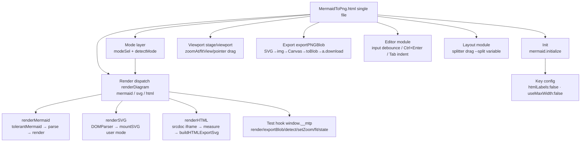
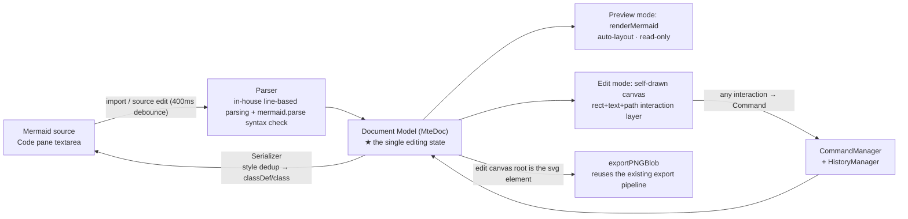

# MermaidToPng Architecture

> A single-file local Mermaid / SVG / HTML → PNG tool. Paste code → live preview → export high-resolution PNG.
> Entry: double-click `MermaidToPng.html`; online version **http://www.jjmermaid.xin**.
> Status: rendering/export, the Agent interface v2 (bridge mode) and the editor layer v3 (WYSIWYG) are all implemented and verified.

## 1. Tech Stack & Governing Principles

- **Rendering engine**: mermaid v11.4.1 (UMD, inlined into the main file, no network dependency) + browser-native SVG/HTML rendering
- **UI**: vanilla HTML/CSS/JS (zero frameworks, zero build); dark cyber theme
- **Export pipeline**: browser-native Canvas 2D + `toBlob('image/png')` (one shared pipeline for all three syntaxes)
- **Persistence**: `localStorage` (code, syntax mode, split ratio, scale, transparent-background preference, appearance, editing snapshots, grid settings)

Three governing principles:

1. **Zero-dependency single file**: `MermaidToPng.html` alone is the whole product — copy it anywhere and double-click; the Agent interface is an optional add-on and never affects manual use.
2. **One export pipeline for three syntaxes**: Mermaid / SVG / HTML inputs all normalize to `state.lastRawSvg` + natural size, then share the same SVG→img→Canvas→toBlob export path.
3. **Test hooks are add-only**: `window.__mtp` / `__mtpAgent` / `__mtpEdit` exist for automated verification; only new methods may be added, signatures never change.

## 2. Rendering & Export Pipeline

### 2.1 Requirement → Implementation Mapping

| Requirement | Implementation |
|---|---|
| Paste code into the Code pane, render in the preview | Left/right split layout; `textarea#code` input debounced 400ms then `renderDiagram()`; Ctrl+Enter renders immediately |
| Three syntaxes (Mermaid / SVG / HTML) | `renderDiagram` dispatches on `state.mode` to `renderMermaid / renderSVG / renderHTML`; the mode comes from `#modeSel` (auto-detect/manual). Auto-detect `detectMode()`: after stripping leading comments/XML declaration/DOCTYPE, a leading `<svg` → svg, any other leading `<` → html, otherwise mermaid |
| SVG input rendering & export | `DOMParser('image/svg+xml')` parse (parsererror detection) → `mountSVG` (keeps non-size root styles); measured natural size is written back to root `width/height` into `lastRawSvg`, then the same export pipeline as Mermaid |
| HTML input rendering | `renderHTML`: srcdoc iframe mount (fragments auto-wrapped into a minimal document + an inline-block wrapper); `pointer-events:none` lets zoom/pan events pass through to the stage |
| HTML size measurement | Fragment: wrapper element `getBoundingClientRect`; full document: `body.getBoundingClientRect` first (respects explicit width/height), expanding only when content truly overflows the container (scroll > client). Working width 900px, overflow widens up to 3840, height always measured from content |
| HTML export | `buildHTMLExportSvg`: clone `documentElement` wrapped in a `<foreignObject>` (width/height = measured size) → same export pipeline; `<script>` in the iframe has already executed, so the clone is the final DOM |
| Preview zoom & pan | `#stage` (overflow:hidden viewport) + `#viewport` (CSS `translate+scale`, origin top-left); wheel zooms with the mouse position as the fixed point; Pointer Events drag; "Fit" and "Zoom" (click to type an exact ratio, 5%–800%) buttons adjust the view; on touch, one finger never pans the preview and a two-finger pinch zooms it (finger-midpoint movement pans) |
| PNG download | SVG → data:URL → `` → Canvas (scaled) → `toBlob` → `<a download>` triggers the browser's save-as |
| Export background / transparency | background picker (click opens a swatch dialog with a "Custom…" entry that programmatically raises the native color picker — works on iOS where the native picker is unavailable), Canvas `fillRect` fill; transparent takes precedence and grays out the color control; the preview canvas syncs the chosen color live (`syncStageBg`); transparent shows a checkerboard in preview and exports true transparency |
| Appearance system | Uploaded image is compressed (longest edge 1920, JPEG 85%) into a global background layer; fill/zoom/blur/mask are four live parameters; a 48×48-bucket quantization + saturation-weighted dominant color is written to `--dominant` (tints the main headings, auto-brightens when too dark); `body.has-bg` enables glass blur and difference blending for text; the appearance incl. dataURL persists as a whole in `mtp.appearance` |

### 2.2 Module Structure (inside the single file)



| Module | Core functions | Notes |
|---|---|---|
| Init | `mermaid.initialize` | `flowchart.htmlLabels:false` — otherwise foreignObject is forbidden when the SVG goes through `` into Canvas and exports come out blank (**the single most critical pitfall in this project**); `useMaxWidth:false` fixes natural size |
| Mode layer | `detectMode / modeOf` | Auto-detect looks only at the first significant token; manual choice stored in `mtp.mode` |
| Render dispatch | `renderDiagram()` | On success all three branches guarantee `state.lastRawSvg` (export source) and `state.vbW/vbH` (natural size); failures never overwrite the previous diagram |
| Mermaid branch | `renderMermaid` | `tolerantMermaid` repair pass (quotes shape labels, rewrites note statements) → `parse` precheck → `render` |
| SVG branch | `renderSVG / mountSVG` | **XML parsing + importNode first**, falling back to innerHTML only for non-strict XML — the HTML parser truncates SVG at breakout tags like `<br/>` in SVG context; size priority: explicit pixel width/height → viewBox → getBBox |
| HTML branch | `renderHTML / buildHTMLExportSvg` | srcdoc iframe preview (interaction passes through); automatic size measurement; export = cloned document in a foreignObject |
| Viewport | `zoomAt/fitView` | Transform = `translate(tx,ty) scale(s)`; wheel fixed-point formula `tx' = mx-(mx-tx)k`; new diagrams auto-fit the window |
| Export | `exportPNGBlob(mult, transparent, bgColor)` | 1×/2×/3× factors; Canvas limit guard (16384 per side / 2^28 total pixels, auto step-down); oversized content falls back from data:URL to blob:URL; filename prefix per mode `mermaid-/svg-/html-` |
| Editor | event layer | 400ms debounced live render; localStorage autosave; Tab inserts two spaces |
| Test hook | `window.__mtp` | `render / exportBlob / detect / setZoom / zoomTo / fit / state` |

## 3. File Inventory

```
MermaidToPng/
├── MermaidToPng.html    # all app code + inlined mermaid library (~2.8MB, double-click to run)
│                        #   Agent button / pairing panel / bridge client / tool implementations (§4)
│                        #   Editor layer: header edit toolbar, left pane "Source|Edit" tabs + grouped edit panel,
│                        #     self-drawn SVG interaction layer, window.__mtpEdit hook, .mte sidecar (§5)
├── MermaidToPng.bat     # double-click to open the main file in the default browser
├── agent/
│   ├── mtp-mcp.mjs      # MCP bridge (§4): pure forwarding + /file drop, zero deps, Node 18+, v2.0.0
│   ├── README.md        # Agent interface guide, English (registration / self-test / troubleshooting)
│   └── Agent_README_cn.md  # Agent interface guide, Chinese
├── deploy/
│   ├── index.html       # deployment copy (byte-identical to the main file)
│   └── mermaid.min.js   # mermaid library copy (identical to the root one)
├── mermaid.min.js       # official mermaid v11.4.1 UMD (2.57MB, for library upgrades)
├── fetch_mermaid.py     # upgrades the mermaid library (npmmirror direct + proxy fallback; stdlib only)
├── README.md            # quick start for users, English (README_cn.md = Chinese)
├── ARCHITECTURE.md      # this document, English (ARCHITECTURE_cn.md = Chinese)
└── .gitignore
```

- After modifying the main file, sync `deploy/index.html` (byte-for-byte copy).
- The editor-layer regression script lives in `.tmp_verify/` (gitignored, rebuilt locally; see §7).

## 4. Agent Interface v2: Bridge Mode

> Goal: any MCP-capable Agent goes straight from "diagram source → PNG on disk" in-session. **All tools execute inside the web page**; locally there is only one pure-forwarding MCP bridge.

```
Agent ──stdio MCP──▶ mtp-mcp.mjs ──HTTP long-poll(127.0.0.1)──▶ the web page itself
              （pure forwarding, zero tool logic）                （all tools execute here）
```

Data flow of one `mtp_render`:

1. The Agent sends `tools/call mtp_render` over stdio; the bridge enqueues it (`forward()`)
2. The page picks up the task on a `/poll` long-poll → executes inside the page: `detectMode → renderDiagram → exportPNGBlob` (reuses the existing pipeline, zero new render logic) → blob→base64
3. The page `POST /file`s the base64 to the bridge, which writes it to the target path (root-directory sandbox)
4. The page `POST /reply`s back a **small result** `{ok, path, width, height, bytes…}`; the bridge resolves the Agent's call
5. PNG bytes never enter the Agent's context

### 4.1 The Bridge `agent/mtp-mcp.mjs` (v2.0.0)

Zero-dependency single file, Node 18+, no npm packages. Launch parameters: `--port` (default **47870**, or env `MTP_MCP_PORT`) / `--root <dir>` (repeatable) / `--code <6 chars>` (fixed pairing code) / `--keep` (don't exit when stdin closes — mandatory for manual terminal launches, otherwise the bridge dies silently with the shell).

| Endpoint | Method | Purpose |
|---|---|---|
| `/status` | GET | `{name, version, paired, port}`; **non-browser requests** additionally get `code` (one curl hands the Agent the pairing code; browser fetch cannot get it, preventing malicious pages from auto-pairing) |
| `/pair` | POST | Page submits the 6-digit code → receives a Bearer token; a new pairing kicks the old page and rotates the code |
| `/hello` | POST | Page reports its tool list → bridge notifies the Agent via `tools/list_changed` |
| `/poll` | GET | Long-poll task pickup (204 after 25s idle; only one long-poll at a time) |
| `/reply` | POST | Page returns a tool result, resolving the pending call |
| `/file` | POST | base64 → file on disk (sandboxed to `--root`) |
| `/bye` | POST | Page-initiated disconnect |

- MCP side (stdio): `initialize` (instructions steer unconnected Agents to call `mtp_connect` first), `ping`, `tools/list` = [`mtp_connect`] + page tools, `tools/call` → `forward()` enqueue and await `/reply`
- Connection management: 45s without a page heartbeat disconnects, rotates the pairing code and clears pending; the bridge's lifecycle belongs to the Agent (stdio parent) — no resident ports, no zombie processes
- CORS/preflight: echo Origin (or `null`) + `Access-Control-Allow-Private-Network: true` — both file:// local pages and the https online page can connect
- Smooth path: the Agent sends the user `http://www.jjmermaid.xin/?mtp=<port>:<code>`; the page reads the params, fills the panel and connects automatically
- Constants: POLL_WAIT 25s / PAGE_TIMEOUT 45s / CALL_TIMEOUT 30min / request body cap 64MB

### 4.2 Page Side & Page Tools

| Part | Description |
|---|---|
| Agent panel | Opened by the "Agent" button left of "Appearance" in the header (popup at top right): port + pairing code + connect/disconnect + status; collapsed by default |
| Bridge client | `pair → hello(tool list) → poll loop → execute → reply`; silent backoff retry on disconnect (never a popup); `beforeunload` best-effort `/bye` |
| Tool implementation | Entirely in the page, calling existing functions (the `__mtpAgent` core: detect / render / export + HTML-branch pending poll ≤15s + Canvas-limit auto step-down into `warnings`) |

Page tools registered dynamically via `/hello`:

| Tool | Params | Return (small envelope, <4KB) |
|---|---|---|
| `mtp_render` | `code`(required) / `output_path`(required, relative = joined to first root) / `mode='auto'` / `scale=2`(1–3) / `transparent=false` / `background='#ffffff'` | Success `{ok:true, mode, width, height, bytes, path, elapsed_ms, warnings[]}`; failure `isError` + `{ok:false, stage, message, detail}` (`stage`∈`detect/render/export/file`, `detail` carries the raw mermaid parser error) |
| `mtp_detect` | `code` | `{mode}` — a pure `detectMode` wrapper, no rendering |

### 4.3 `/file`: Dropping Large Binaries

A 2× PNG is commonly 0.1–2MB; base64 straight into the Agent context is unacceptable. After the drop, the tool result is <1KB.

```
POST /file   (Authorization: Bearer <token>)
{ "path": "out/arch.png", "base64": "…", "overwrite": true }
→ 200 { "ok": true, "path": "<resolved absolute path>", "bytes": 123456 }
→ 403 { "error": "path outside root" }
```

- **Root-directory sandbox**: relative paths join the first root; absolute paths must resolve inside one of the roots (Windows case-insensitive prefix comparison, `..` escapes rejected); `~` is expanded by the bridge; default root = `~/Downloads` (safe fallback)
- Requires a paired token; the bridge listens on 127.0.0.1 only; this endpoint is a generic "page → disk" transport holding no rendering knowledge

### 4.4 Registration & First Use

Add to the Agent's `mcp_servers` configuration:

```json
"mermaid-to-png": {
  "command": "node",
  "args": [
    "<project dir>/agent/mtp-mcp.mjs",
    "--port", "47870",
    "--root", "<output dir>/out",
    "--root", "~/Downloads"
  ],
  "connect_timeout": 30,
  "enabled": true
}
```

First use: the Agent calls `mtp_connect` → gets the pairing code → the user opens http://www.jjmermaid.xin (or local `MermaidToPng.html`), enters port + code in the Agent panel and connects → everything after that is automatic. After a page refresh/reopen the token is invalidated and the bridge rotates the code; Agent-side tools report "page not connected" — call `mtp_connect` again for the new code and re-pair. Registration/self-test/troubleshooting: `agent/README.md`.

### 4.5 Implementation Notes

1. **file:// → 127.0.0.1 fetch**: a file:// page's Origin is the string `null`; echoing origin-or-null + the PNA preflight header is enough. If some Edge version interferes, the fallback is the online page or a local http server.
2. **Background-tab throttling**: the long-poll loop must continue via recursive `await fetch`, never chained setTimeout (Chrome throttles background setTimeout chains to ≥1min).
3. **HTML-branch race**: `renderHTML` returns pending synchronously; `lastRawSvg` only exists after the iframe `load` — the tool polls up to 15s before exporting.
4. **`/file` sandbox check**: prefix comparison after `path.resolve` uses `path.win32` case-insensitively; both bridge and page validate; `overwrite` defaults to false.
5. **Pairing lifecycle**: page refresh invalidates the token → the bridge rotates the code; the page never caches old tokens, reconnection always goes through `/pair`.
6. **Concurrency**: the page's single poll loop is serial by construction; the bridge's `forward` queue preserves order with a 30min timeout as backstop.

### 4.6 Verification Status

e2e 18/18 (2026-10-06, headless Edge + CDP driving the real page): file:// and http page origins × pairing/tool list/three-syntax render-to-disk/bad-input errors/sandbox escape 403/disconnect awareness/result size <4KB/fixed pairing code/`--keep` residency/`?mtp=` link direct-connect — all passed; pure-https site connectivity verified against a local static server standing in for the deployment.

## 5. Editor Layer v3: WYSIWYG

> Scenario: import a Mermaid logic diagram → enter edit mode → drag nodes/edges, change text and styles → real-time WYSIWYG → auto-write-back to the Mermaid source; save `.mte` / copy / export PNG.

### 5.1 Three Settled Decisions

| # | Decision | Rationale |
|---|---|---|
| **D1** | **Mermaid source is just an I/O format; editing state = an owned Document Model (`MteDoc`)**. Import: Parser source→Model; editing: touch only the Model; export: Serializer Model→source. Never treat the rendered SVG DOM as the data source; never do visual edits on the source string | Otherwise drag/style/undo become string-fragment surgery — unmaintainable |
| **D2** | **The edit-mode canvas is a self-drawn SVG interaction layer, independent of mermaid layout**. Preview mode keeps `renderMermaid` (auto-layout, read-only); edit mode switches to the self-drawn canvas with coordinates from Model.layout | mermaid is an auto-layout engine (dagre): node coordinates are read-only and any change retriggers a full relayout — WYSIWYG cannot hold |
| **D3** | **Position/size never write back to the Mermaid source; styles do**. `x/y/w/h` live in Model.layout (persisted in the `.mte` sidecar); `font/color/background/border` serialize into `classDef` + `class` statements | mermaid has no node-coordinate syntax; if positions are lost the diagram can still be re-laid-out by mermaid (acceptable degradation) |

### 5.2 Data-Flow Loop



The direction of modification is always `canvas interaction → Command → Model → (Serializer→source & partial canvas refresh)`; **the UI must never touch the Model directly, and must never assemble source strings directly**.

### 5.3 Document Model (schemaVersion 1.0)

```typescript
/** Document root: Single Source of Truth */
interface MteDoc {
  schemaVersion: "1.0";          // upgrades go through Migration (dispatched on schemaVersion)
  diagramType: "flowchart";      // flowchart only for now; the field is the extension point
  nodes: MteNode[];              // subgraphs materialize into group nodes (children)
  edges: MteEdge[];
  layout: {                      // D3: canvas layout data, never written back to source
    canvas: { w: number; h: number };
    node: Record<string, { x: number; y: number; w: number; h: number }>;
  };
  meta: { createdAt?: string; updatedAt?: string; extensions?: Record<string, unknown> };
}

interface MteNode {
  id: string;                    // imports keep original ids; new nodes use genId() to avoid conflicts
  type: "rect" | "round" | "diamond" | "cylinder" | "circle" | "stadium" | "parallelogram" | "group" | "label";
  text: string;                  // '\n' ↔ source <br/>
  style: {                       // fully materialized onto the node (expanded on import, deduped on export)
    fontFamily?: string; fontSize?: number; bold?: boolean; italic?: boolean;
    color?: string; bg?: string; stroke?: string;
    strokeWidth?: number; radius?: number; dashed?: boolean; bgOpacity?: number;
  };
  children?: string[];           // group only (subgraph members)
}

interface MteEdge {
  id: string;
  from: string; to: string;
  label?: string;
  kind: "arrow" | "line" | "dotted" | "thick";   // --> / --- / -.-> / ==>
}
```

### 5.4 Modes & Interaction

```text
┌────────────────────────────────────────────────────────────────┐
│ header: logo · 【Undo · Redo · Import · Download mte】(edit mode only) · Agent · Appearance │
├──────────────┬───────────────────────────────────┬─────────────┤
│ Left pane    │ Canvas (edit mode = self-drawn    │ (existing   │
│ tabs:        │   SVG interaction layer)          │ two-pane    │
│ [Source|Edit]│       (preview mode = mermaid     │ layout,     │
│ Edit panel   │        render)                    │ draggable   │
│ · Components │  drag-in/select/move/resize/      │ splitter)   │
│ · Font       │  double-click to edit text        │             │
│ · Color      │  single select shows 8-way        │             │
│ · Appearance │  resize handles;                  │             │
│ · Layout     │  Ctrl+click add/remove selection; │             │
│ · View       │  Ctrl+drag rubber-band select;    │             │
│              │  Delete removes (batch);          │             │
│              │  Ctrl+Z/Y undo/redo;              │             │
│              │  Ctrl+Alt+S download mte          │             │
└──────────────┴───────────────────────────────────┴─────────────┘
```

- **Entering/exiting edit goes only through the "Edit" tab**: clicking "Edit" = enter (auto-parse + switch to self-drawn canvas + expand groups); clicking "Source" = exit (write back source + return to preview render). The header has no "enter edit" button; the edit toolbar group is toggled by `body.edit-mode`.
- **Keyboard/mouse**: double-click a node to edit text (floating `<textarea>`: Enter saves, Shift+Enter newline, Esc cancels, blur saves; equivalent entry = the "Text content" field atop the Font group); Ctrl+Z undo, Ctrl+Y / Ctrl+Shift+Z redo; Ctrl+Alt+S save .mte; Ctrl+click add/remove selection; Ctrl+drag on empty canvas rubber-band selects; Delete/Backspace removes (batch for multi-select; removing applies to the edge when an edge is selected); Enter enters text editing (single selection).
- **Edge drawing (click mode)**: clicking the "arrow/solid/dashed" card in the Components group enters edge mode → all nodes show 8 anchors (4 corners + 4 edge midpoints) → click the start anchor → click the end anchor to create the edge (anchors stored in `doc.layout.edge[edgeId] = {a, b}`, never written back to source); clicking anywhere on a node snaps to the nearest anchor as a fallback; Esc cancels.
- **Edge editing**: clicking an edge selects it and shows three edit handles — head/tail squares re-pick endpoints (other nodes allowed); the middle circle drags the bend (quadratic Bézier control point solved from the drag, so the curve's midpoint lands at the drag point); double-click the edge line or its label to edit the edge label (the `edge.label` command is undoable; serialization emits `---|text|` pipe syntax). Hit-testing unconditionally covers both ends; endpoint overrides apply per end (changing one end takes effect immediately, the uncovered end falls back to center clipping).
- **Label component**: a borderless, transparent-background text annotation; highest click-selection priority; serialization auto-injects a `fill:none,stroke:none` classDef and the parser recognizes such nodes back as labels (round-trip stable).
- **Grid guides**: bottom-most dashed row/column lines on the edit canvas (SVG pattern, rect ±60000 covering the entire visible canvas area); colors adapt to the background — transparent = neutral gray, solid = a low-saturation complementary color (HSL hue +180°), with a background image the appearance accent `--aux` is used; the "View" group holds the toggle + spacing 10–500px, persisted in `localStorage['mte.grid']`; the grid layer is temporarily removed before serialization — **never exported into the PNG**. While guides are on, node moves (single & multi) and resizes snap to grid lines (left/center/right, top/middle/bottom candidates, smallest non-zero correction wins; threshold = 7 screen px converted to canvas units, capped at gap/3; line-like components — edge midpoint/endpoint drags and link mode — never snap).
- **Canvas navigation**: wheel = zoom in both edit and preview modes, drag on empty canvas = pan; on touch, dragging a node moves it, dragging a resize handle scales it (touch-enlarged hit zones), dragging empty space does nothing (no preview panning), and a two-finger pinch zooms the preview with finger-midpoint panning — entering pinch bounces back any in-flight component drag; the preview page never pages (vertical scrolling belongs to the edit panel itself).
- **Multi-select**: `selectedIds` set + `selectedId` primary (last clicked); style changes apply to all selected nodes; moving a multi-select is one `node.moveMany` command; no resize handles and the Layout group grays out during box/multi-select. "Background opacity" is a node-level style (↔ source `fill-opacity`, also applies to groups/labels).
- **Downloading mte** (button formerly labeled "Save"): the `.mte` sidecar (JSON: `{schemaVersion, source, doc, savedAt}`) lands via `<a download>`; the `mtp.doc` snapshot writes to localStorage throttled at 1s, restoring the editing scene (incl. manual layout) after refresh.
- Edit panel colors: group titles/active tab = the background image's vivid accent `--vivid`; body and labels = the background image's dominant color `--dominant`; without a background image the `:root` default purple applies.

### 5.5 In-File Module Layout

| Namespace | Responsibility | Key API |
|---|---|---|
| `Editor.model` | MteDoc structure, defaults, id generation, deep clone, Migration entry | `createDoc() / cloneDoc() / genId()` |
| `Editor.parser` | Source → MteDoc (in-house line-based parsing, whitelist in §5.8-2); mermaid.parse only prechecks syntax | `parseFlowchart(src): {doc, warnings[]}` |
| `Editor.serializer` | MteDoc → source (style dedup into classDef/class; layout never written back) | `serialize(doc): string` |
| `Editor.commands` | Command implementations for every mutation | `exec(type, payload)` |
| `Editor.history` | Undo/redo stacks, command merging | `undo() / redo() / push(cmd)` |
| `Editor.registry` | ComponentRegistry / ToolbarGroupRegistry | `register(def)` |
| `Editor.canvas` | Self-drawn canvas: rendering, selection/handles, drag/resize/text overlay, partial refresh | `mount(container) / render(doc) / refreshNode(id)` |
| `Editor.panel` | Edit panel rendering (group accordion, controls bound to Commands), mode switching | `init() / setMode(edit|preview)` |
| `Editor.sync` | Source ⇄ Model two-way sync, loop guard (origin tags), localStorage snapshots | `onCodeChange(src) / writeCode(doc)` |
| `window.__mtpEdit` | Test hook (add-only) | see §7 |

### 5.6 Commands & Undo

Every mutation goes through a command; each implements `apply(doc) / revert(doc)`; the undo stack caps at 100; Ctrl+Z never merges across command types.

| Command | payload | Merge policy |
|---|---|---|
| `node.add` | `{node, x, y}` | — |
| `node.delete` | `{id}` (**cascades to associated edges**, revert restores) | — |
| `node.text` | `{id, text}` | consecutive inputs on the same id merge within an 800ms window |
| `node.style` | `{id, patch}` | merges per id+field |
| `node.move / node.resize` | `{id, x, y, w, h}` | pointermove only moves the canvas, not the stack; pointerup pushes |
| `node.moveMany` | batch move for multi-select | same as move |
| `edge.add / edge.delete` | create / remove edges | — |
| `edge.anchor / edge.mid / edge.label` | endpoint / bend point / label | undoable |

### 5.7 Built-in Components & Groups

- Built-in components: rect, round, diamond, cylinder, circle, stadium, parallelogram, group, label. Components register as `ComponentDefinition` (type/label/thumbnail/createDefault); dragging into the canvas drops at the pointer as the position.
- Edit panel groups (`ToolbarGroup` declarative controls → auto-bound to Commands): Components (shape cards), Font (family/size/bold/italic/align/text content), Color (text/background/border colors, compact rows + swatch dialog: 24 presets / reset-to-default / "Custom…" raising the native picker — recolorable on iOS where the native picker is missing), Appearance (border width/corner radius/dash toggle/background opacity), Layout (X/Y/W/H numeric inputs + fit-to-canvas), View (grid toggle + spacing). New groups are a `register()` call away — Editor Core untouched.

### 5.8 Pitfall List

**Design & parsing**

1. `mermaid.parse`'s AST is undocumented and unstable → use it only as a syntax validator; structure parsing is in-house.
2. **The in-house parser hard-codes a whitelist subset**: shape syntax, chained `A-->B-->C`, `A & B --> C` (split into multiple edges), the four edge kinds, `subgraph … end`, `classDef/class/style`, `%%comments`. **Unsupported syntax is never dropped**: it is stored verbatim in `meta.extensions.rawLines` and entering edit mode warns "line N uses unsupported syntax; editing will ignore it".
3. **Nodes must be pure SVG (rect/text/tspan/path), foreignObject forbidden** — the export pipeline SVG→img→Canvas forbids external content, the same pitfall as `htmlLabels:false`; text uses multi-line `<tspan>` with `getBBox`-fitted sizes.
4. **Label escaping**: double quotes → `#quot;`; the `<br/>` ↔ `\n` round-trip must be implemented pairwise (round-trip tests cover it).
5. **id conflicts**: new `genId()` checks existing nodes; duplicate ids on import = parse error; non-ASCII (e.g. Chinese) ids are kept verbatim.
6. **Two-way sync loop guard**: every `Editor.sync` write-back carries an origin (`'code'|'canvas'`); programmatic textarea writes must not retrigger the debounce parse.
7. **Style materialization/dedup**: import expands `classDef/class/style` into `node.style`; serialization groups by style signature and emits `classDef c0,c1… + class n1,n2 c0`. Round-trip goal: structure 100% equivalent, styles semantically equivalent.

**Layout & serialization (verified during implementation)**

8. **mermaid v11 cluster positioning**: `g.cluster` elements carry no transform — a subgraph's position/size lives in the inner `<rect>`'s attributes (absolute canvas coordinates); nodes (`g.node`) do use `transform: translate(center)` + getBBox. The two readings must not be mixed.
9. **Parallelogram serialization forbids inner quotes**: mermaid 11.4.1 fails on `id[/"text"/]` with `got 'STR'` — the serializer emits `id[/text/]` (in-label `"` is already escaped, so no conflict).
10. **scanShape builds labels char by char**: the closer matching an opener is pushed first (an empty initial stack makes every shape recognition fail); slicing whole spans would fold the inner closers of composite shapes `[(x)]`/`((x))`/`([x])` into the label.
11. **Undo snapshot contamination**: command revert must deep-clone `old` before assigning back, otherwise redo's apply mutates the snapshot in place and repeated undo/redo breaks deep comparison. move/resize canvas growth belongs inside the command (apply + revert both adjust canvas size).
12. **Empty classDef is a mermaid syntax error**: when a style signature has no outputtable keys, skip the whole group — otherwise a bare `classDef cN ` line makes mermaid throw `got 'NEWLINE'` (surfacing only at the next parse). Serializer style output must be checked key by key.
13. **Layout migration on reimport/re-parse**: a freshly parsed doc's `layout.node` is always empty — the migration condition must be "the new doc has a node with the same name" then **assign** the old coordinates; conditioning on the new coordinates existing silently wipes manual layout on every source edit.
14. **Partially covered layout state needs per-end fallbacks**: edge anchors are judged per end — a covered end uses its anchor, an uncovered end falls back to center clipping (requiring both ends to exist makes the first single-end change look like a no-op). Likewise, geometry updates must precede visibility short-circuits (changing spacing while hidden must still update geometry).

**UI & maintenance**

15. **overflow:hidden children inside flex column scroll containers get silently squashed**: edit panel children need `flex:none`, otherwise the CSS "automatic minimum size" zeroes out and the scrollbar never appears. For any "the container has overflow:auto but won't scroll", check this combination first.
16. **Inserting fragments into the single-file HTML must anchor on a unique sequence**: `'</head>'` also matches literals inside the mermaid library string (multiple places); inserting into a JS string breaks syntax and wipes out every global. Run `node --check` immediately after any insertion.
17. **Headless regression script cautions** (`.tmp_verify/`, rebuilt locally): under `--virtual-time-budget` `createImageBitmap` never resolves (sample pixels via `Image + createObjectURL`); a real download `a.click()` hangs the page (stub it in tests); synthetic event dispatch needs live DOM references (`refreshNode` rebuilds node DOM); `__mtpEdit.doc()` returns a deep clone, so assertion side effects must re-query each time; run `node --check` on injected scripts after edits (a start marker matching source literals = false positive); assert inline styles on parsed values, not string prefixes (`hsla(...)` reads back as `rgba(...)`).

### 5.9 Acceptance Status & Roadmap

**Acceptance**: Chrome headless (`--headless=new --dump-dom` + injected script) — 152/152 assertions passing (2026-10-08), covering 13 acceptance categories (import/edit/styles/move-resize/delete/undo-redo/round-trip/two-way sync/export/save-restore/legacy regression) plus the iteration items (multi-select & box select, edge drawing & edge editing, label component, grid guides, edit panel scrolling); Pass B verifies refresh restore incl. manual layout; edit-mode screenshots visually inspected.

**Additional acceptance (2026-10-08)**: mobile compatibility & interaction improvements — "Download mte" rename, "Zoom" button redone as exact-ratio input, grid snapping (move + resize, line-like excluded), touch gestures (one-finger component drag, two-finger pinch zoom/pan, pinch interrupt bounce-back) and the swatch color picker — Edge headless regression 30/30 assertions passing (render, button labels, dialogs, no-pan-on-touch, pinch, touch drag & resize, snap-to-grid, undo, swatch recolor/reset, background swatch, serialization, no JS errors).

**Roadmap** (not yet implemented):

- Alignment, grid snapping, minimap, copy/paste
- subgraph group editing (dragging a group moves its members)
- "Auto re-layout" button: drop manual layout, back to mermaid dagre layout
- sequence / class diagrams (new diagramType + new Parser/Serializer branches; Editor Core untouched)
- MCP tool `mtp_edit` (Agents edit diagrams directly through the same `__mtpEdit` core)

### 5.10 Mobile Compatibility & Interaction Improvements (2026-10-08)

> The input layer branches on `e.pointerType === 'touch'` (`TOUCH_DEVICE` media query only sets defaults, e.g. enlarged touch hit zones); the editing core (MteDoc / Command / Serializer) is fully shared.

| Item | Behavior |
|---|---|
| "Save" → "Download mte" | Header edit-tool button renamed (it downloads a .mte file); `Ctrl+Alt+S` and `__mtpEdit.saveMte` unchanged |
| "1:1" button redone as "Zoom" | Click opens a dialog for an exact ratio: 5%–800%; input ≤20 is read as a multiplier (1.5→150%), >20 as percent; `zoomTo()` keeps the viewport center as the fixed point; `__mtp.zoomTo` hook added (add-only) |
| Grid snapping | With guides on, node moves (single & multi) and resizes snap to grid lines (smallest non-zero correction among left/center/right, top/middle/bottom; threshold 7 screen px in canvas units, ≤ gap/3); line-like components (edge midpoint/endpoint drags, link mode) never snap |
| One-finger gestures | Drag a node = move it; drag a resize handle = scale it (touch-enlarged hit zones: handles 16px / anchors 6px / edge points 15px, thresholds 18/14/16px); drag empty space = nothing (**no preview panning**; desktop mouse panning unchanged) |
| Two-finger gestures | Pinch in/out = zoom the preview, midpoint movement = pan (`#stage` capture-phase gesture state machine, same clamp 0.05–8 as desktop); entering pinch calls `Editor.canvas.cancelDrag()` to bounce back an in-flight drag; dropping to one finger returns to IDLE without resuming it |
| Swatch color picking | iOS Safari lacks `<input type="color">`, which left text/background/border colors and the export background unchangeable on mobile; color swatches now open a swatch dialog (24 presets + reset + "Custom…"); MteDoc stays device-independent (no render override, no document pollution) |

Implementation notes: pinch uses capture-phase listeners (unaffected by the canvas `stopPropagation`) tracking a two-pointer ID map; the zoom formula `tx = fingerCenter - (startCenter - startTx) × ns/startScale` does zoom+pan in one step; snapping lives inside the Editor (`gridSnap1 / gridSnapDelta / gridSnapResize`) — moves snap by the dragged bounding box, resizes only snap the moving edge.

## 6. Known Limitations

- **Save-location dialog**: Edge/Chrome require "ask where to save each file" in browser settings for the location prompt; Firefox prompts by default. Browser security model — a web page cannot bypass it.
- **HTML mode external resources**: the export pipeline (data:URL SVG) loads no external images/CSS/fonts — inline images as base64 data URLs and keep CSS in `<style>`/`style` attributes. The preview iframe is equally restricted under file://.
- **HTML mode script execution**: preview and export execute `<script>` in the pasted HTML (export captures the post-execution DOM) — paste trusted content only.
- **HTML without intrinsic size**: width defaults to the 900px working width (overflow widens up to 3840px), height measured from content; `100vh`-style documents compute against the initial 800px working height.
- **Sequence and similar diagram types**: `sequence` etc. may still render text via foreignObject internally; if individual diagram types export blank, that is upstream mermaid behavior.

## 7. Verification & Maintenance

**Test hooks** (add-only signatures; automated verification entry points):

| Hook | Methods |
|---|---|
| `window.__mtp` | `render / exportBlob / detect / setZoom / zoomTo / fit / state` |
| `window.__mtpAgent` | Agent tool core (detect / render / export), reused by the MCP bridge |
| `window.__mtpEdit` | `enter / exit / isActive / doc / exec / addNode / select / selectMany / updateText / updateStyle / move / resize / del / undo / redo / serialize / importDoc / saveMte / restoreMte / state` (version `'3.0'`) |

**Regression script**: the editor-layer regression script lives at `.tmp_verify/run_verify.py` (gitignored, rebuilt locally following the cautions in §5.8-17; Chrome headless injection, Pass A functional assertions + Pass B refresh restore).

**Maintenance items**:

- After modifying the main file, sync the deployment copy: `cp MermaidToPng.html deploy/index.html`.
- Live site: `http://www.jjmermaid.xin` serves the `deploy/` directory contents.
- Page icon: inlined in `<head>` as `<link rel="icon" href="data:image/x-icon;base64,…">`; to change it, re-base64 and replace that href.
- Upgrading mermaid: `python fetch_mermaid.py` pulls a new `mermaid.min.js`, then re-inline the library into the main file (replace the first `<script>…</script>` inline block, the one holding the mermaid library).
- Agent interface (§4): bridge and page-tool registration, self-test and troubleshooting in `agent/README.md`.

## 8. References

- Mermaid syntax docs: https://mermaid.ai/open-source/syntax/flowchart.html
- mermaid repository: https://github.com/mermaid-js/mermaid
- foreignObject (how HTML export works): https://developer.mozilla.org/docs/Web/SVG/Element/foreignObject
