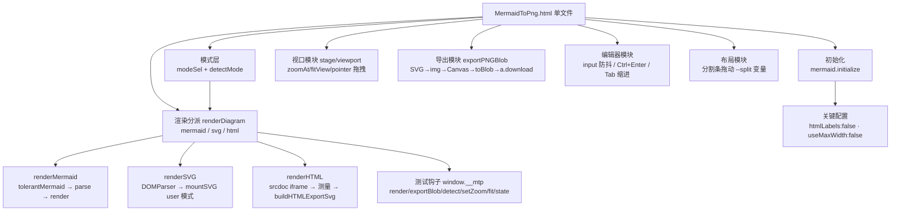

# MermaidToPng 项目架构

> 单文件本地 Mermaid / SVG / HTML → PNG 工具。粘贴代码 → 实时预览（缩放/拖拽）→ 导出高清 PNG。
> 状态：**已实现并实测通过**（见文末验证清单，2026-10-05 新增 SVG/HTML 语法支持）。
> 入口：`MermaidToPng.html`，双击即用；`deploy/index.html` 为同步部署副本。

## 1. 需求 → 设计映射

| 需求 | 实现 |
|---|---|
| 粘贴代码到 Code 页，预览页渲染 | 左右分栏布局；`textarea#code` 输入 400ms 防抖后 `renderDiagram()`；Ctrl+Enter 立即渲染 |
| 三语法支持（Mermaid / SVG / HTML） | `renderDiagram` 按 `state.mode` 分派到 `renderMermaid / renderSVG / renderHTML`；模式来自 `#modeSel`（自动检测/手动），自动检测 `detectMode()`：剥前导注释/XML 声明/DOCTYPE 后，`<svg` 开头 → svg，其余 `<` 开头 → html，否则 mermaid（Mermaid 代码不以 `<` 开头） |
| SVG 输入渲染与导出 | `DOMParser('image/svg+xml')` 解析（parsererror 检测）→ 序列化挂载 `mountSVG(svg, true)`（保留根节点非尺寸样式）；测得自然尺寸后回写根 `width/height` 存入 `lastRawSvg`，走与 Mermaid 完全相同的导出管线 |
| HTML 输入渲染 | `renderHTML`：srcdoc iframe 挂载（片段自动包装成最小文档 + inline-block 包裹层）；`pointer-events:none` 让缩放/拖拽事件穿透到 stage；尺寸自动测量（见下） |
| HTML 尺寸测量 | 片段：包裹元素 `getBoundingClientRect`（收缩到内容）；完整文档：`body.getBoundingClientRect` 优先（尊重显式宽高），仅当内容真溢出容器（scroll > client）才扩展；工作宽 900px，溢出放宽上限 3840，高度按内容实测 |
| HTML 导出 | `buildHTMLExportSvg`：克隆 `documentElement` 包进 `<foreignObject>`（width/height=实测尺寸）→ `lastRawSvg` → 与 Mermaid 相同的 SVG→img→Canvas 管线；iframe 中 `<script>` 已执行，克隆的是最终 DOM |
| 预览图可缩放、拖拽 | `#stage`（overflow:hidden 视口）+ `#viewport`（CSS `translate+scale`，origin 左上）；滚轮以鼠标位置为不动点缩放；Pointer Events 拖拽；双击/按钮适应窗口；1:1 按钮 |
| 下载 PNG 且可选位置 | SVG → `data:image/svg+xml` → `` → Canvas（倍率缩放）→ `toBlob` → `<a download>` 触发浏览器另存为对话框（用户自选位置） |
| 导出背景色 | `input[type=color]` 底色选择器，Canvas `fillRect` 填色；透明底勾选优先并联动置灰；选择存 localStorage |
| 所见即所得背景 | 预览画布背景实时同步所选底色（`syncStageBg`，改色/透明/启动三处触发）；透明底时预览显示棋盘格占位，导出 PNG 为真透明 |
| Mermaid 语法参考 | 内置 mermaid v11.4.1 官方 UMD（内联进主文件，离线可用），支持全部官方图型与语法 |

## 2. 形态选型（为什么是单文件 HTML）

| 方案 | 体积 | 依赖 | 保存位置对话框 | 结论 |
|---|---|---|---|---|
| **单文件 HTML** ✅ | ~2.6MB（主要是 mermaid.js） | 无（双击即用） | 浏览器原生另存为 | 采纳 |
| mermaid-live-editor（官方） | 整套 SvelteKit 工具链 | pnpm/Docker | 浏览器另存为 | 功能全但过重，且仅 SVG 导出一等公民 |
| Electron | ~150MB 打包 | Node + 打包链 | 原生对话框 | 杀鸡用牛刀 |
| Tauri | ~10MB | Rust 工具链 | 原生对话框 | 需 Rust，维护成本高 |

零安装、离线可用、`file://` 直开，浏览器下载天然弹"保存位置"。

## 3. 技术栈

- **渲染引擎**：mermaid v11.4.1（UMD，内联进主文件，无网络依赖）+ 浏览器原生 SVG/HTML 渲染
- **UI**：原生 HTML/CSS/JS（零框架、零构建）；深色赛博主题（霓虹紫/青、毛玻璃卡片）
- **导出管线**：浏览器原生 Canvas 2D + `toBlob('image/png')`（三语法共用同一条管线）
- **持久化**：`localStorage`（代码、语法模式、分栏比例、倍率、透明底偏好）

## 4. 模块结构（单文件内）



| 模块 | 核心函数 | 要点 |
|---|---|---|
| 初始化 | `mermaid.initialize` | `flowchart.htmlLabels:false` —— 否则 SVG 经 `` 转 Canvas 时 foreignObject 被禁，导出全空白（本项目最关键的一个坑）；`useMaxWidth:false` 固定自然尺寸 |
| 模式层 | `detectMode / modeOf` | 自动检测只看首个有效标记（剥注释/XML 声明/DOCTYPE）；手动选择存 `mtp.mode` |
| 渲染分派 | `renderDiagram()` | 三个分支成功后都保证 `state.lastRawSvg`（导出源）与 `state.vbW/vbH`（自然尺寸）就位；失败不覆盖旧图 |
| Mermaid 分支 | `renderMermaid` | `tolerantMermaid` 容错（形状标签补引号、note 语句改写）→ `parse` 预检 → `render` |
| SVG 分支 | `renderSVG` | parsererror 检测并显示；挂载保留用户根样式（只剥尺寸键）；导出源回写显式 width/height |
| SVG 挂载 | `mountSVG` | **XML 解析 + importNode 优先**，非严格 XML 才回退 innerHTML——HTML 解析器在 SVG 上下文遇 `<br/>` 等 breakout 标签会截断 SVG（实测 4440 字符源码只挂上 1261 字符，其后元素全部丢失）；尺寸优先级：显式像素宽高 → viewBox → getBBox |
| HTML 分支 | `renderHTML / buildHTMLExportSvg` | srcdoc iframe 预览（`pointer-events:none` 穿透交互）；尺寸自动测量（工作宽 900/溢出放宽/文档尊重显式尺寸）；导出=克隆文档包 foreignObject |
| 视口 | `zoomAt/fitView` | 变换 = `translate(tx,ty) scale(s)`；滚轮不动点公式 `tx' = mx-(mx-tx)k`；新图渲染后自动适应窗口 |
| 导出 | `exportPNGBlob(mult, transparent, bgColor)` | 1×/2×/3× 倍率；Canvas 上限保护（单边 16384 / 总像素 2^28，超限自动降倍率）；超长内容 data:URL 自动降级 blob:URL；文件名前缀按模式 `mermaid-/svg-/html-` |
| 编辑器 | 事件层 | 400ms 防抖实时渲染；localStorage 自动保存；Tab 插入两空格 |
| 外观模块 | `applyAppearance / extractDominant / loadBgFile` | 上传图片压缩（最长边 1920 JPEG85%）设为 `#bgLayer`（fixed，z-index:-1）背景；四参数（填充 object-fit / 缩放 transform scale / 模糊 filter blur / 遮罩独立 `#bgMask` 层）实时应用；48×48 桶量化 + 饱和度加权提取主色写 `--dominant`（三个主标题着色，过暗自动提亮）；`body.has-bg` 启用玻璃模糊（header/card-h：backdrop blur 18px + saturate 1.5 + 高光顶边）与其余文字 `mix-blend-mode:difference`；外观含 dataURL 整体持久化 `mtp.appearance` |
| 测试钩子 | `window.__mtp` | 自动化验证入口：`render / exportBlob / detect / setZoom / fit / state` |

## 5. 文件清单

```
MermaidToPng/
├── MermaidToPng.html    # 全部应用代码 + 内联 mermaid 库（2.6MB，双击即用）
├── deploy/index.html    # 部署副本（与主文件逐字节同步）
├── mermaid.min.js       # mermaid v11.4.1 官方 UMD（2.57MB，升级库用）
├── MermaidToPng.bat     # 双击用默认浏览器打开主文件
├── fetch_mermaid.py     # 升级 mermaid 库（npmmirror 直连 + 代理回退）
├── build_portable.py    # 旧构建脚本（针对已废弃的 Mermaid.html 分离版；当前布局不适用）
├── README.md            # 面向使用者的快速上手
├── ARCHITECTURE.md      # 本文档
└── .gitignore
```

### 可移植性

- 单文件即全部：拷 `MermaidToPng.html` 一个文件到任何电脑双击即用。
- 修改主文件后需同步 `deploy/index.html`（逐字节拷贝）。

## 6. 已验证清单（agent-browser + Chrome for Testing 152 真机，20/20 通过）

| 项 | 结果 |
|---|---|
| eval Promise 支持 / 页面加载 | ✅ |
| 语法自动检测 9 组输入（mermaid×3 / svg×3 / html×3，含 %%指令、XML 声明、注释、DOCTYPE 前缀） | ✅ |
| Mermaid 回归：渲染 graph TD（108×174）、lastRawSvg 就位 | ✅ |
| SVG 渲染 420×180、导出源写入显式尺寸 | ✅ |
| SVG 导出 2×：PNG magic、840×360、角落=[255,255,255,255]、中心=[124,58,237,255]（紫） | ✅ |
| HTML 片段渲染：iframe 挂载、实测尺寸 242×103、导出源含 foreignObject | ✅ |
| HTML 导出 2×：PNG magic、中心=渐变色非白 | ✅ |
| HTML 内嵌 `<script>` 执行，结果文本进入导出串 | ✅ |
| 完整文档（显式 300×120 + 背景 #123456）：按自身尺寸渲染，背景随导出保留（角落=[18,52,86,255]） | ✅ |
| 坏 SVG：报错显示、旧图 lastRawSvg 不被覆盖 | ✅ |
| Mermaid 重渲染 + setZoom(1.5) transform 正确 | ✅ |
| 三模式截图目检（Mermaid 流程图 / SVG 卡片 / HTML 渐变卡片） | ✅ |
| **修复回归**：含 `<br/>` 的复杂 SVG（校园门禁架构图 900×650）完整渲染——rect 2→16、text 22、path 3，导出 2× 像素色值与源码色板吻合（#fff2cc/#fff4e6），与参考图一致 | ✅ |
| **修复回归**：Mermaid / 常规 SVG / HTML 三路挂载路径不受影响 | ✅ |
| 外观系统：主色提取（橙图 → rgb(230,127,34) 精确命中）、logo/tag 主色着色、玻璃 backdrop blur(18px) saturate(1.5)、按钮/textarea/dim 差值混合、参数（zoom 150/blur 8/mask 40/contain）实时生效、localStorage 持久化与刷新恢复、移除背景还原默认 | ✅ |

历史版本（Edge 153 + CDP）验证过的基础能力——滚轮缩放、拖拽、透明底导出（角落 [0,0,0,0]）、3× 倍率、PNG magic 落盘——本次未改动该部分逻辑，继续有效。

## 7. 已知限制

- **保存位置对话框**：Edge/Chrome 需在设置里开启"每次下载前询问保存位置"才弹位置选择；Firefox 默认弹窗。这是浏览器安全模型，网页无法绕过。
- **HTML 模式外部资源**：导出管线（data:URL SVG）不加载外部图片/CSS/字体——图片用 base64 data URL 内联，样式写 `<style>`/`style` 属性。预览 iframe 同样受 file:// 限制。
- **HTML 模式脚本执行**：预览与导出数据构建会执行粘贴 HTML 中的 `<script>`（导出截取执行后 DOM），只应粘贴可信内容。
- **HTML 无固有尺寸**：宽度默认工作宽 900px（内容溢出自动放宽至上限 3840px），高度按内容实测；`100vh` 类文档按初始工作高 800px 计算。
- **序列图等图型**：`sequence` 等内部可能仍用 foreignObject 渲染文本，若个别图型导出空白，属 mermaid 上游行为。

## 8. 参考资料

- Mermaid 语法文档（Flowchart 等）：https://mermaid.ai/open-source/syntax/flowchart.html
- mermaid 官方仓库：https://github.com/mermaid-js/mermaid
- foreignObject（HTML 导出原理）：https://developer.mozilla.org/docs/Web/SVG/Element/foreignObject

## 9. 维护

- 修改主文件后同步部署副本：`cp MermaidToPng.html deploy/index.html`。
- 升级 mermaid：`python fetch_mermaid.py` 拉新版 `mermaid.min.js`，然后将新库内联进主文件（替换第一个 `<script>...</script>` 内联块）。`build_portable.py` 针对已废弃的分离版布局，当前不适用。
- 自动化验证：页面暴露 `window.__mtp` 钩子，可用 agent-browser（eval -b base64 避免转义）跑渲染/导出断言。
