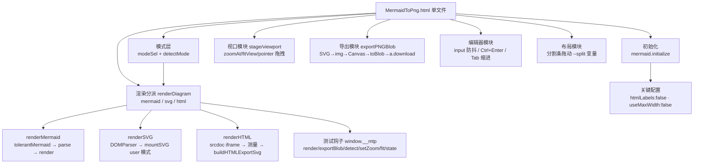
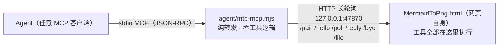

# MermaidToPng 项目架构

> 单文件本地 Mermaid / SVG / HTML → PNG 工具。粘贴代码 → 实时预览→ 导出高清 PNG。
> 状态：**已实现并实测通过**
> 入口：`MermaidToPng.html` 双击即用；线上版 **http://www.jjmermaid.xin**。
> Agent 接口层 v2（桥模式：工具全部在网页里执行，MCP 桥纯转发 + `/file` 落盘）：架构见 §8，**已实现并实测通过**（v1 CDP 无头方案曾实现并验证，按 §8.0 的理由替换移除）。

## 1. 需求 → 设计映射

| 需求 | 实现 |
|---|---|
| 粘贴代码到 Code 页，预览页渲染 | 左右分栏布局；`textarea#code` 输入 400ms 防抖后 `renderDiagram()`；Ctrl+Enter 立即渲染 |
| 三语法支持（Mermaid / SVG / HTML） | `renderDiagram` 按 `state.mode` 分派到 `renderMermaid / renderSVG / renderHTML`；模式来自 `#modeSel`（自动检测/手动），自动检测 `detectMode()`：剥前导注释/XML 声明/DOCTYPE 后，`<svg` 开头 → svg，其余 `<` 开头 → html，否则 mermaid（Mermaid 代码不以 `<` 开头） |
| SVG 输入渲染与导出 | `DOMParser('image/svg+xml')` 解析（parsererror 检测）→ 序列化挂载 `mountSVG(svg, true)`（保留根节点非尺寸样式）；测得自然尺寸后回写根 `width/height` 存入 `lastRawSvg`，走与 Mermaid 完全相同的导出管线 |
| HTML 输入渲染 | `renderHTML`：srcdoc iframe 挂载（片段自动包装成最小文档 + inline-block 包裹层）；`pointer-events:none` 让缩放/拖拽事件穿透到 stage；尺寸自动测量（见下） |
| HTML 尺寸测量 | 片段：包裹元素 `getBoundingClientRect`（收缩到内容）；完整文档：`body.getBoundingClientRect` 优先（尊重显式宽高），仅当内容真溢出容器（scroll > client）才扩展；工作宽 900px，溢出放宽上限 3840，高度按内容实测 |
| HTML 导出 | `buildHTMLExportSvg`：克隆 `documentElement` 包进 `<foreignObject>`（width/height=实测尺寸）→ `lastRawSvg` → 与 Mermaid 相同的 SVG→img→Canvas 管线；iframe 中 `<script>` 已执行，克隆的是最终 DOM |
| 预览图可缩放、拖拽 | `#stage`（overflow:hidden 视口）+ `#viewport`（CSS `translate+scale`，origin 左上）；滚轮以鼠标位置为不动点缩放；Pointer Events 拖拽；双击/按钮适应窗口；1:1 按钮 |
| 下载 PNG 且可选位置 | SVG → `data:image/svg+xml` → `` → Canvas（倍率缩放）→ `toBlob` → `<a download>` 触发浏览器另存为对话框（用户自选位置） |
| 导出背景色 | `input[type=color]` 底色选择器，Canvas `fillRect` 填色；透明底勾选优先并联动置灰；选择存 localStorage |
| 所见即所得背景 | 预览画布背景实时同步所选底色（`syncStageBg`，改色/透明/启动三处触发）；透明底时预览显示棋盘格占位，导出 PNG 为真透明 |
| Mermaid 语法参考 | 内置 mermaid v11.4.1 官方 UMD（内联进主文件，离线可用），支持全部官方图型与语法 |

## 2. 形态选型（为什么是单文件 HTML）

| 方案 | 体积 | 依赖 | 保存位置对话框 | 结论 |
|---|---|---|---|---|
| **单文件 HTML** ✅ | ~2.6MB（主要是 mermaid.js） | 无（双击即用） | 浏览器原生另存为 | 采纳 |
| mermaid-live-editor（官方） | 整套 SvelteKit 工具链 | pnpm/Docker | 浏览器另存为 | 功能全但过重，且仅 SVG 导出一等公民 |
| Electron | ~150MB 打包 | Node + 打包链 | 原生对话框 | 杀鸡用牛刀 |
| Tauri | ~10MB | Rust 工具链 | 原生对话框 | 需 Rust，维护成本高 |

零安装、离线可用、`file://` 直开，浏览器下载天然弹"保存位置"。

## 3. 技术栈

- **渲染引擎**：mermaid v11.4.1（UMD，内联进主文件，无网络依赖）+ 浏览器原生 SVG/HTML 渲染
- **UI**：原生 HTML/CSS/JS（零框架、零构建）；深色赛博主题（霓虹紫/青、毛玻璃卡片）
- **导出管线**：浏览器原生 Canvas 2D + `toBlob('image/png')`（三语法共用同一条管线）
- **持久化**：`localStorage`（代码、语法模式、分栏比例、倍率、透明底偏好）

## 4. 模块结构（单文件内）



| 模块 | 核心函数 | 要点 |
|---|---|---|
| 初始化 | `mermaid.initialize` | `flowchart.htmlLabels:false` —— 否则 SVG 经 `` 转 Canvas 时 foreignObject 被禁，导出全空白（本项目最关键的一个坑）；`useMaxWidth:false` 固定自然尺寸 |
| 模式层 | `detectMode / modeOf` | 自动检测只看首个有效标记（剥注释/XML 声明/DOCTYPE）；手动选择存 `mtp.mode` |
| 渲染分派 | `renderDiagram()` | 三个分支成功后都保证 `state.lastRawSvg`（导出源）与 `state.vbW/vbH`（自然尺寸）就位；失败不覆盖旧图 |
| Mermaid 分支 | `renderMermaid` | `tolerantMermaid` 容错（形状标签补引号、note 语句改写）→ `parse` 预检 → `render` |
| SVG 分支 | `renderSVG` | parsererror 检测并显示；挂载保留用户根样式（只剥尺寸键）；导出源回写显式 width/height |
| SVG 挂载 | `mountSVG` | **XML 解析 + importNode 优先**，非严格 XML 才回退 innerHTML——HTML 解析器在 SVG 上下文遇 `<br/>` 等 breakout 标签会截断 SVG（实测 4440 字符源码只挂上 1261 字符，其后元素全部丢失）；尺寸优先级：显式像素宽高 → viewBox → getBBox |
| HTML 分支 | `renderHTML / buildHTMLExportSvg` | srcdoc iframe 预览（`pointer-events:none` 穿透交互）；尺寸自动测量（工作宽 900/溢出放宽/文档尊重显式尺寸）；导出=克隆文档包 foreignObject |
| 视口 | `zoomAt/fitView` | 变换 = `translate(tx,ty) scale(s)`；滚轮不动点公式 `tx' = mx-(mx-tx)k`；新图渲染后自动适应窗口 |
| 导出 | `exportPNGBlob(mult, transparent, bgColor)` | 1×/2×/3× 倍率；Canvas 上限保护（单边 16384 / 总像素 2^28，超限自动降倍率）；超长内容 data:URL 自动降级 blob:URL；文件名前缀按模式 `mermaid-/svg-/html-` |
| 编辑器 | 事件层 | 400ms 防抖实时渲染；localStorage 自动保存；Tab 插入两空格 |
| 外观模块 | `applyAppearance / extractDominant / loadBgFile` | 上传图片压缩（最长边 1920 JPEG85%）设为 `#bgLayer`（fixed，z-index:-1）背景；四参数（填充 object-fit / 缩放 transform scale / 模糊 filter blur / 遮罩独立 `#bgMask` 层）实时应用；48×48 桶量化 + 饱和度加权提取主色写 `--dominant`（三个主标题着色，过暗自动提亮）；`body.has-bg` 启用玻璃模糊（header/card-h：backdrop blur 18px + saturate 1.5 + 高光顶边）与其余文字 `mix-blend-mode:difference`；外观含 dataURL 整体持久化 `mtp.appearance` |
| 测试钩子 | `window.__mtp` | 自动化验证入口：`render / exportBlob / detect / setZoom / fit / state` |

## 5. 文件清单

```
MermaidToPng/
├── MermaidToPng.html    # 全部应用代码 + 内联 mermaid 库（2.6MB，双击即用）
│                        #   v2：+ Agent 按钮（header「外观」左侧）/ 右上角配对面板 / 桥客户端 / mtp_render·mtp_detect 工具实现（§8.3，页面内增量）
├── agent/
│   ├── mtp-mcp.mjs      # v2 MCP 桥（§8.2，已实现）：纯转发 + /file 落盘，零依赖 Node 18+
│   └── README.md        # Agent 接口层使用说明（注册 / 自测 / 排障）
├── deploy/index.html    # 部署副本（与主文件逐字节同步；网页版连同一个本地桥）
├── mermaid.min.js       # mermaid v11.4.1 官方 UMD（2.57MB，升级库用）
├── MermaidToPng.bat     # 双击用默认浏览器打开主文件
├── fetch_mermaid.py     # 升级 mermaid 库（npmmirror 直连 + 代理回退）
├── README.md            # 面向使用者的快速上手
├── ARCHITECTURE.md      # 本文档
└── .gitignore
```


### 可移植性

- 单文件即全部：拷 `MermaidToPng.html` 一个文件到任何电脑双击即用（Agent 接口是可选增强，没有桥与配对也不影响手工使用）。
- 修改主文件后需同步 `deploy/index.html`（逐字节拷贝）。

## 6. 已验证清单

| 项 | 结果 |
|---|---|
| eval Promise 支持 / 页面加载 | ✅ |
| 语法自动检测 9 组输入（mermaid×3 / svg×3 / html×3，含 %%指令、XML 声明、注释、DOCTYPE 前缀） | ✅ |
| Mermaid 回归：渲染 graph TD（108×174）、lastRawSvg 就位 | ✅ |
| SVG 渲染 420×180、导出源写入显式尺寸 | ✅ |
| SVG 导出 2×：PNG magic、840×360、角落=[255,255,255,255]、中心=[124,58,237,255]（紫） | ✅ |
| HTML 片段渲染：iframe 挂载、实测尺寸 242×103、导出源含 foreignObject | ✅ |
| HTML 导出 2×：PNG magic、中心=渐变色非白 | ✅ |
| HTML 内嵌 `<script>` 执行，结果文本进入导出串 | ✅ |
| 完整文档（显式 300×120 + 背景 #123456）：按自身尺寸渲染，背景随导出保留（角落=[18,52,86,255]） | ✅ |
| 坏 SVG：报错显示、旧图 lastRawSvg 不被覆盖 | ✅ |
| Mermaid 重渲染 + setZoom(1.5) transform 正确 | ✅ |
| 三模式截图目检（Mermaid 流程图 / SVG 卡片 / HTML 渐变卡片） | ✅ |
| **修复回归**：含 `<br/>` 的复杂 SVG（校园门禁架构图 900×650）完整渲染——rect 2→16、text 22、path 3，导出 2× 像素色值与源码色板吻合（#fff2cc/#fff4e6），与参考图一致 | ✅ |
| **修复回归**：Mermaid / 常规 SVG / HTML 三路挂载路径不受影响 | ✅ |
| 外观系统：主色提取（橙图 → rgb(230,127,34) 精确命中）、logo/tag 主色着色、玻璃 backdrop blur(18px) saturate(1.5)、按钮/textarea/dim 差值混合、参数（zoom 150/blur 8/mask 40/contain）实时生效、localStorage 持久化与刷新恢复、移除背景还原默认 | ✅ |

历史版本（Edge 153 + CDP）验证过的基础能力——滚轮缩放、拖拽、透明底导出（角落 [0,0,0,0]）、3× 倍率、PNG magic 落盘——本次未改动该部分逻辑，继续有效。

## 7. 已知限制

- **保存位置对话框**：Edge/Chrome 需在设置里开启"每次下载前询问保存位置"才弹位置选择；Firefox 默认弹窗。这是浏览器安全模型，网页无法绕过。
- **HTML 模式外部资源**：导出管线（data:URL SVG）不加载外部图片/CSS/字体——图片用 base64 data URL 内联，样式写 `<style>`/`style` 属性。预览 iframe 同样受 file:// 限制。
- **HTML 模式脚本执行**：预览与导出数据构建会执行粘贴 HTML 中的 `<script>`（导出截取执行后 DOM），只应粘贴可信内容。
- **HTML 无固有尺寸**：宽度默认工作宽 900px（内容溢出自动放宽至上限 3840px），高度按内容实测；`100vh` 类文档按初始工作高 800px 计算。
- **序列图等图型**：`sequence` 等内部可能仍用 foreignObject 渲染文本，若个别图型导出空白，属 mermaid 上游行为。

## 8. Agent 接口层 v2：桥模式
> 目标：任意 Agent（任何支持 MCP 的客户端）在会话内直接「图表源码 → PNG 落盘」。**工具全部在网页里执行**，本地只有一个纯转发的 MCP 桥。
>技术参考：https://lumisynth.cielaniska.top/
```
Agent ──stdio MCP──▶ mtp-mcp.mjs ──HTTP长轮询(127.0.0.1)──▶ 网页自身
              （纯转发，零工具逻辑）                    （工具全部在这执行）
```

### 8.1 总体架构



一次 `mtp_render` 的数据流：

1. Agent 经 stdio 发 `tools/call mtp_render`，桥入队（`forward()`）
2. 页面长轮询 `/poll` 领到任务 → 在页面里执行工具：`detectMode → renderDiagram → exportPNGBlob`（复用现有管线，零新渲染逻辑）→ blob→base64
3. 页面 `POST /file` 让桥把 base64 写入目标路径（根目录沙箱，§8.4）
4. 页面 `POST /reply` 回传**小结果** `{ok, path, width, height, bytes…}`，桥 resolve 给 Agent
5. PNG 字节全程不进 Agent 上下文

### 8.2 桥 `agent/mtp-mcp.mjs`

零依赖单文件，Node 18+，无任何 npm 依赖。三个要点：品牌字段（`serverInfo.name='mermaid-to-png'`、`mtp_connect` 工具文案、instructions）、默认端口 **47870**、通用 `/file` 落盘端点（§8.4）。

| 端点 | 方法 | 作用 |
|---|---|---|
| `/status` | GET | `{name, version, paired, port}`；**非浏览器请求**（无 Origin / Sec-Fetch-Site）额外返回 `code`，Agent 一条 curl 即可取配对码，浏览器 fetch 拿不到（防恶意网页自动配对） |
| `/pair` | POST | 页面提交 6 位配对码 → 发 Bearer token；新配对踢旧页并换新码 |
| `/hello` | POST | 页面上报工具清单 → 桥发 `tools/list_changed` 通知 Agent |
| `/poll` | GET | 长轮询领任务（25s 空转返回 204；同刻只保留一个长轮询） |
| `/reply` | POST | 页面回传工具结果，resolve 对应 pending 调用 |
| `/file` | POST | base64 → 磁盘文件（沙箱限 `--root`，§8.4） |
| `/bye` | POST | 页面主动断开 |

- MCP 侧（stdio）：`initialize`（instructions 引导 Agent 未连接先调 `mtp_connect`）、`ping`、`tools/list` = [`mtp_connect`（桥内置，返回配对码与端口）] + 页面工具、`tools/call` → `forward()` 入队等 `/reply`；prompts 透传（本项目的页面上报为空）
- 连接管理：页面 45s 无心跳即断开并换新配对码、清空 pending；桥进程生命周期归 Agent（stdio 父进程），**无服务注册、无端口常驻、无僵尸进程问题**
- CORS/预检：回显 Origin（或 `null`）+ `Access-Control-Allow-Private-Network: true`（Chrome 从 https/file 页面访问 127.0.0.1 的 PNA 预检）——file:// 本地页与线上 https 页均可连
- 启动参数：`--port` / `--root`（可多次）/ `--code <6位>`（固定配对码，重启不换）/ `--keep`（stdin 关闭不退出——未注册 MCP 的客户端用终端手动拉桥时必带，否则桥随 shell 关闭静默死亡）
- 丝滑路径：Agent 把 `http://www.jjmermaid.xin/?mtp=<端口>:<配对码>` 发给用户，页面读参自动填面板并连接
- 常量实测值：POLL_WAIT 25s / PAGE_TIMEOUT 45s / CALL_TIMEOUT 30min / 请求体上限 64MB

### 8.3 页面侧

| 部件 | 说明 |
|---|---|
| Agent 面板 | header「外观」左侧的「Agent」按钮展开（右上角弹出）：端口 + 配对码 + 「连接/断开」+ 状态；默认收起，不干扰手工使用 |
| 桥客户端 | `pair → hello(工具清单) → poll 循环 → 执行 → reply`；断线**静默退避重试**（绝不弹窗）；`beforeunload` 尽力发 `/bye` |
| 工具实现 | 全在页面，直接调现有函数 |

页面上报的工具（经 `/hello` 动态注册，Agent 的 `tools/list` 即时可见）：

| 工具 | 入参 | 返回（小信封，<4KB） |
|---|---|---|
| `mtp_render` | `code`(必填) / `output_path`(必填，相对路径=拼根目录) / `mode='auto'` / `scale=2`(1–3) / `transparent=false` / `background='#ffffff'` | 成功 `{ok:true, mode, width, height, bytes, path, elapsed_ms, warnings[]}`；失败 `isError` + `{ok:false, stage, message, detail}`（`stage`∈`detect/render/export/file`，`detail` 带 mermaid parser 原始报错，供 Agent 转述排错） |
| `mtp_detect` | `code` | `{mode}`——纯 `detectMode` 包装，不渲染，供 Agent 预检语法 |

工具内核复用 v1 已验证的 `__mtpAgent.render` 逻辑（detect / render / export + HTML 分支 pending 轮询 ≤15s + Canvas 超限自动降倍率进 `warnings`），唯一差异：末步从「返回 base64」改为「`/file` 落盘后返回路径」。`window.__mtp` 测试钩子不动。

### 8.4 `/file`：大二进制落盘

**为什么不走工具结果回 base64**：2× PNG 常见 0.1–2MB，base64 后 0.13–2.7MB 字符直灌 Agent 上下文（数万~数十万 token），不可接受。落盘后工具结果 <1KB。

```
POST /file   (Authorization: Bearer <token>)
{ "path": "out/arch.png", "base64": "…", "overwrite": true }
→ 200 { "ok": true, "path": "<resolve 后的绝对路径>", "bytes": 123456 }
→ 403 { "error": "path outside root" }
```

- **根目录沙箱**：启动参数 `--root <dir>` 可多次；相对 path 拼第一个 root，绝对 path 必须 resolve 后落在某个 root 内（Windows 大小写不敏感前缀比对，拒绝 `..` 逃逸）
- 默认 root = `~/Downloads`（安全兜底）；Agent 注册时显式传更宽的 root（§8.5）
- 需已配对 token；桥仅监听 127.0.0.1。该端点是「页面→磁盘」的**通用传输件**，不含任何 Mermaid/渲染知识——工具逻辑仍在页面

### 8.5 Agent 注册与使用

在 Agent 的 `mcp_servers` 配置中添加（各客户端通用，键名兼容）：

```json
"mermaid-to-png": {
  "command": "node",
  "args": [
    "<项目目录>/agent/mtp-mcp.mjs",
    "--port", "47870",
    "--root", "<输出目录>/out",
    "--root", "~/Downloads"
  ],
  "connect_timeout": 30,
  "enabled": true
}
```

- 注册名 `mermaid-to-png`；端口可用 `--port` 或环境变量 `MTP_MCP_PORT` 覆盖
- **首次使用**：Agent 调 `mtp_connect` → 拿到配对码 → 用户打开 http://www.jjmermaid.xin（或本地 `MermaidToPng.html`），在 header「外观」左侧的「Agent」面板填端口+码点连接 → 之后全程自动
- **首次使用**：Agent 调 `mtp_connect` → 拿到配对码 → 用户在页面 Agent 面板填端口+码点连接 → 之后全程自动
- 页面刷新/重开后 token 失效、桥换新码，Agent 端表现为工具报「页面未连接」，转告用户重新配对即可

### 8.6 文件布局

```
MermaidToPng/
├── MermaidToPng.html     # + Agent 面板 / 桥客户端 / 工具实现（页面内增量，§8.3）
├── agent/
│   ├── mtp-mcp.mjs       # 桥（§8.2）——本地唯一新增程序文件
│   └── README.md         # 注册 / 自测 / 排障
├── deploy/index.html     # 照旧逐字节同步；线上版 http://www.jjmermaid.xin 连同一个本地桥（PNA 预检已处理）
└── …（其余不变）
```

`out/` 落盘根目录运行时自动创建。v1 的 5 个 Python 文件已删除（见 §5 迁移注）。

### 8.7 实现坑清单

1. **file:// → 127.0.0.1 fetch**：file:// 页面 Origin 为字符串 `null`，桥 CORS 回显 origin 或 `null` + PNA 预检头即可工作（已用 Edge 实测，§8.8 第 1 项）；若个别版本 Edge 拦截，兜底 = 访问线上页 http://www.jjmermaid.xin 或本地 http 服务。
2. **后台标签页节流**：Chrome 对后台页 setTimeout 链节流至 ≥1min；长轮询循环必须 `await fetch` 递归续跑，不能用 setTimeout 串起来。
3. **HTML 分支竞态**（v1 实测）：`renderHTML` 同步返回 pending，`lastRawSvg` 要等 iframe `load`——工具内轮询等待 ≤15s 再导出，否则误报「没有可导出的内容」。
4. **Canvas 上限**：超限自动降倍率并把降级事实写进 `warnings`；内容 1× 自然尺寸即超 16384 时照 v1 补一条超限 warning（导出仍成功）。
5. **`/file` 沙箱校验**：`path.resolve` 后前缀比对用 `path.win32` 且大小写不敏感；桥与页面两侧各校验一次；`overwrite` 默认 false。
6. **配对生命周期**：页面刷新 token 失效 → 桥自动换新码并发 `tools/list_changed`；页面侧不要缓存旧 token，重连永远从 `/pair` 走。
7. **并发**：页面单 poll 循环串行执行，天然无并发问题；桥 `forward` 队列保序，30min 超时兜底。
8. **大 base64**：`/file` 请求体上限 64MB（`readBody` 已有保护）；几 MB PNG 远够用。
9. **同步部署副本**：主文件加面板后 `deploy/index.html` 照旧逐字节同步。

### 8.8 验证清单

| 项 | 通过 |
|---|---|
| Edge file:// 双击打开页面 → 面板配对成功，Agent 端 `tools/list` 出现 `mtp_render`/`mtp_detect` | ☑ 2026-10-06（无头 Edge + CDP 驱动真页面实测） |
| `mtp_render` 三语法（mermaid/svg/html）各一例 → PNG magic + 尺寸断言 + 文件落在 root 内 | ☑ 2026-10-06（相对路径拼第一个 root、绝对路径 root 内均验） |
| 坏 mermaid 输入 → `isError`，`detail` 含原始 parser 报错文本 | ☑ 2026-10-06 |
| `/file` 越界路径（`../x.png`、root 外绝对路径）→ 403 拒绝 | ☑ 2026-10-06（页面预校验 + 桥沙箱双层） |
| 页面刷新/断开 → 旧 token 失效、新配对码生成，Agent 端可感知（工具列表收缩 + 渲染报「页面没有连接」） | ☑ 2026-10-06（经 /bye 断开路径验证；beforeunload 为尽力送达） |
| 页面转后台标签页时 `mtp_render` 仍完成（长轮询不被节流打断） | ☑ 待真机人工验证（长轮询为 await fetch 递归续跑，符合 §8.7-2 要求） |
| 工具结果体积 <4KB（PNG 字节不进上下文） | ☑ 2026-10-06 |
| `deploy/index.html`（https）连同一个本地桥成功 | ☑ 2026-10-06（以本地 http 静态服务模拟部署页源验证连通；纯 https 站点待上线后复验） |
| 连续调用无残留 node 进程 / 端口占用（桥随 Agent stdio 生命周期） | ☑ 2026-10-06（桥重启×2 + 18 个测试孤儿进程全清后 0 残留） |
| `/status` 非浏览器请求返回 `code`、浏览器 fetch 拿不到（安全门控） | ☑ 2026-10-06 |
| `--code` 固定配对码 / `--keep` stdin 关闭驻留 | ☑ 2026-10-06 |
| `?mtp=端口:配对码` 链接打开页面 → 自动填面板并连接成功（toast 提示） | ☑ 2026-10-06 |

e2e 合计 18/18（file:// 与 http 两种页面来源 × 配对/列表/三语法渲染/沙箱/断开感知/结果体积）。

### 8.9 RoadMap

- CLI 包装（`node agent/mtp-mcp.mjs --interactive` 命令行配对/渲染）——脚本化需求出现再做
- `theme` 参数（mermaid 主题切换，需 re-initialize）/ SVG 直出（信封加字段即可）
- 多页面 / 多 Agent 并发（当前单页面单 Agent 够用）

## 9. 参考资料

- Mermaid 语法文档（Flowchart 等）：https://mermaid.ai/open-source/syntax/flowchart.html
- mermaid 官方仓库：https://github.com/mermaid-js/mermaid
- foreignObject（HTML 导出原理）：https://developer.mozilla.org/docs/Web/SVG/Element/foreignObject

## 10. 维护

- 修改主文件后同步部署副本：`cp MermaidToPng.html deploy/index.html`。
- 升级 mermaid：`python fetch_mermaid.py` 拉新版 `mermaid.min.js`，然后将新库内联进主文件（替换第一个 `<script>...</script>` 内联块）。
- 自动化验证：页面暴露 `window.__mtp` 钩子，可用 agent-browser（eval -b base64 避免转义）跑渲染/导出断言。
- Agent 接口层（§8）：桥与页面工具的注册、自测、排障见 `agent/README.md`。`__mtpAgent` 内核与 `__mtp` 一样只增不改签名。
- 线上站点：`http://www.jjmermaid.xin` 部署 `deploy/` 目录内容；改主文件后部署副本一并更新。
