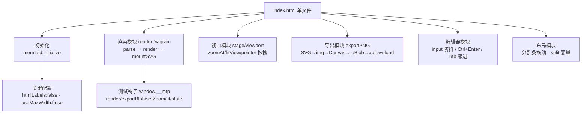

# MermaidToPng 项目架构

> 单文件本地 Mermaid → PNG 工具。粘贴代码 → 实时预览（缩放/拖拽）→ 导出高清 PNG。
> 状态：**已实现并实测通过**（见文末验证清单）。入口：`index.html`，双击即用。

## 1. 需求 → 设计映射

| 需求 | 实现 |
|---|---|
| 粘贴代码到 Code 页，预览页渲染 | 左右分栏布局；`textarea#code` 输入 400ms 防抖后 `mermaid.parse` + `mermaid.render`；Ctrl+Enter 立即渲染 |
| 预览图可缩放、拖拽 | `#stage`（overflow:hidden 视口）+ `#viewport`（CSS `translate+scale`，origin 左上）；滚轮以鼠标位置为不动点缩放；Pointer Events 拖拽；双击/按钮适应窗口；1:1 按钮 |
| 下载 PNG 且可选位置 | SVG → `data:image/svg+xml` → `` → Canvas（倍率缩放）→ `toBlob` → `<a download>` 触发浏览器另存为对话框（用户自选位置） |
| 导出背景色（新增） | `input[type=color]` 底色选择器，Canvas `fillRect` 填色；透明底勾选优先并联动置灰；选择存 localStorage |
| 所见即所得背景（新增） | 预览画布背景实时同步所选底色（`syncStageBg`，改色/透明/启动三处触发）；透明底时预览显示棋盘格占位，导出 PNG 为真透明 |
| Mermaid 语法参考 | 内置 mermaid v11.4.1 官方 UMD（`mermaid.min.js` 本地 vendored，2.57MB，离线可用），支持全部官方图型与语法 |

## 2. 形态选型（为什么是单文件 HTML）

| 方案 | 体积 | 依赖 | 保存位置对话框 | 结论 |
|---|---|---|---|---|
| **单文件 HTML** ✅ | ~2.6MB（主要是 mermaid.js） | 无（双击即用） | 浏览器原生另存为 | 采纳 |
| mermaid-live-editor（官方） | 整套 SvelteKit 工具链 | pnpm/Docker | 浏览器另存为 | 功能全但过重，且仅 SVG 导出一等公民 |
| Electron | ~150MB 打包 | Node + 打包链 | 原生对话框 | 杀鸡用牛刀 |
| Tauri | ~10MB | Rust 工具链 | 原生对话框 | 需 Rust，维护成本高 |

零安装、离线可用、`file://` 直开，浏览器下载天然弹"保存位置"。升级 mermaid 只需覆盖 `mermaid.min.js`（https://cdn.jsdelivr.net/npm/mermaid@11/dist/mermaid.min.js）。

## 3. 技术栈

- **渲染引擎**：mermaid v11.4.1（UMD，本地 vendored，无网络依赖）
- **UI**：原生 HTML/CSS/JS（零框架、零构建）；深色赛博主题（霓虹紫/青、毛玻璃卡片）
- **导出管线**：浏览器原生 Canvas 2D + `toBlob('image/png')`
- **持久化**：`localStorage`（代码、分栏比例、倍率、透明底偏好）

## 4. 模块结构（单文件内）



| 模块 | 核心函数 | 要点 |
|---|---|---|
| 初始化 | `mermaid.initialize` | `flowchart.htmlLabels:false` —— 否则 SVG 经 `` 转 Canvas 时 foreignObject 被禁，导出全空白（本项目最关键的一个坑）；`useMaxWidth:false` 固定自然尺寸 |
| 渲染 | `renderDiagram()` | 先 `parse` 预检，失败不覆盖旧图；`render(id, code)` 产出 SVG 字符串存入 `state.lastRawSvg`（导出数据源）；从 viewBox 提取自然宽高 |
| 视口 | `zoomAt/fitView` | 变换 = `translate(tx,ty) scale(s)`；滚轮不动点公式 `tx' = mx-(mx-tx)k`；新图渲染后自动适应窗口 |
| 导出 | `exportPNGBlob(mult, transparent, bgColor)` | 1×/2×/3× 倍率；透明底或自选底色（`fillRect`，默认白）；文件名 `mermaid-<时间戳>.png`；`URL.revokeObjectURL` 防内存泄漏 |
| 编辑器 | 事件层 | 400ms 防抖实时渲染；localStorage 自动保存；Tab 插入两空格 |
| 测试钩子 | `window.__mtp` | 自动化验证入口：`render / exportBlob / setZoom / fit / state` |

## 5. 文件清单

```
MermaidToPng/
├── Mermaid.html      # 全部应用代码（~19KB，原名 index.html，用户已改名）
├── mermaid.min.js    # mermaid v11.4.1 官方 UMD（2.57MB，本地内置）
├── MermaidToPng-standalone.html  # 单文件构建版（mermaid 已内联，2.6MB，单独拷走即用）
├── MermaidToPng-portable.zip     # 便携包（standalone + 开发版 + 说明 + 构建脚本）
├── MermaidToPng.bat  # 双击用默认浏览器打开单文件版
├── 使用说明.txt       # 面向使用者的快速上手
├── fetch_mermaid.py  # 升级 mermaid 库（npmmirror 直连 + 代理回退）
├── build_portable.py # 重新生成 standalone 与 zip（仅 Python 标准库）
├── sample-output.png # 实测导出样例（2× 白底）
└── ARCHITECTURE.md   # 本文档
```

### 构建与移植

- `python build_portable.py` 生成两个产物：**standalone 单文件**（把 mermaid.min.js 内联进 HTML，内联前转义 `</script` 防解析器提前截断）与**便携 zip**。
- 单文件版实测通过：无外部 `script[src]`、渲染/缩放/导出与开发版行为一致（角落像素精确匹配所选底色）。
- 可移植性核心约束：`Mermaid.html` 与 `mermaid.min.js` 必须成对移动；单独分发永远用 standalone 版。

## 6. 已验证清单（真实 Edge 153 + CDP 实测）

| 项 | 结果 |
|---|---|
| file:// 直开加载，示例图自动渲染（1044×174） | ✅ |
| 粘贴新代码实时渲染（graph TD 250×439） | ✅ |
| 滚轮缩放至 150%，transform 正确 | ✅ |
| 拖拽位移 (+150,+80) 与鼠标位移一致 | ✅ |
| 错误语法 → 红框报错，旧图保留 | ✅ |
| 导出 2× 白底：角落像素 [255,255,255,255]，含图形内容 | ✅ |
| 导出 2× 透明底：角落像素 [0,0,0,0] | ✅ |
| 导出 3×：846×210，尺寸随倍率正确缩放 | ✅ |
| 落盘文件 PNG magic（`\x89PNG`）校验通过 | ✅ |

## 7. 已知限制与可选演进

- **保存位置对话框**：Edge/Chrome 需在设置里开启"每次下载前询问保存位置"才弹位置选择；Firefox 默认弹窗。这是浏览器安全模型，网页无法绕过（Electron/Tauri 才有原生对话框）。
- **序列图等图型**：`sequence` 等内部可能仍用 foreignObject 渲染文本，若个别图型导出空白，属 mermaid 上游行为（可切 `themeCSS` 或升级版本观察）。
- 演进方向（均不影响现有结构）：SVG 导出按钮（现成 `state.lastRawSvg`）；主题切换（`mermaid.initialize` 的 `theme`）；Ctrl+滚轮缩放替代纯滚轮；批量多图导出。

## 8. 参考资料

- Mermaid 语法文档（Flowchart 等）：https://mermaid.ai/open-source/syntax/flowchart.html
- mermaid 官方仓库：https://github.com/mermaid-js/mermaid
- mermaid-live-editor（备选现成方案）：https://github.com/mermaid-js/mermaid-live-editor

## 9. 备选现成项目

如果只是想要功能而非自建：官方 **mermaid-js/mermaid-live-editor**（mermaid.live 源码，MIT，SvelteKit，`pnpm dev` 或 Docker 本地跑，实时预览/缩放拖拽/shares/PNG 导出齐全）。

## 10. 维护

升级 mermaid：覆盖 `mermaid.min.js` 即可，或运行 `python fetch_mermaid.py`（自动尝试 npmmirror 直连 + jsdelivr/unpkg 走 Clash 7897 代理）。
