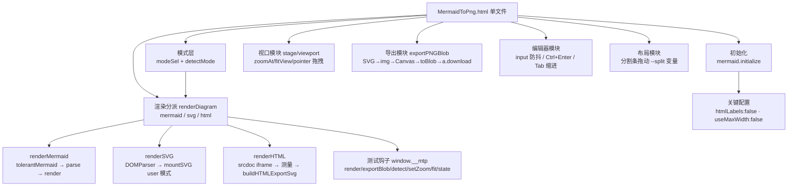
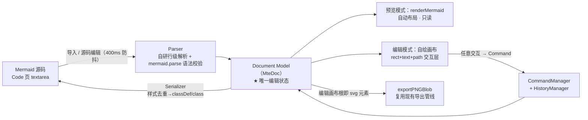

# MermaidToPng 项目架构

> 单文件本地 Mermaid / SVG / HTML → PNG 工具。粘贴代码 → 实时预览 → 导出高清 PNG。
> 入口：`MermaidToPng.html` 双击即用；线上版 **http://www.jjmermaid.xin**。
> 状态：渲染导出、Agent 接口层 v2（桥模式）、编辑层 v3（所见即所得）均已实现并实测通过。

## 1. 技术栈与总原则

- **渲染引擎**：mermaid v11.4.1（UMD，内联进主文件，无网络依赖）+ 浏览器原生 SVG/HTML 渲染
- **UI**：原生 HTML/CSS/JS（零框架、零构建）；深色赛博主题
- **导出管线**：浏览器原生 Canvas 2D + `toBlob('image/png')`（三语法共用同一条管线）
- **持久化**：`localStorage`（代码、语法模式、分栏比例、倍率、透明底偏好、外观、编辑快照、辅助线设置）

三条总原则：

1. **零依赖单文件**：`MermaidToPng.html` 一个文件即全部功能，拷到任何电脑双击即用；Agent 接口是可选增强，不配桥不影响手工使用。
2. **三语法一条导出管线**：Mermaid / SVG / HTML 三种输入最终都归一为 `state.lastRawSvg` + 自然尺寸，走同一条 SVG→img→Canvas→toBlob 导出路径。
3. **测试钩子只增不改签名**：`window.__mtp` / `__mtpAgent` / `__mtpEdit` 三个钩子供自动化验证使用，只允许新增方法。

## 2. 渲染与导出管线

### 2.1 需求 → 实现映射

| 需求 | 实现 |
|---|---|
| 粘贴代码到 Code 页，预览页渲染 | 左右分栏布局；`textarea#code` 输入 400ms 防抖后 `renderDiagram()`；Ctrl+Enter 立即渲染 |
| 三语法支持（Mermaid / SVG / HTML） | `renderDiagram` 按 `state.mode` 分派到 `renderMermaid / renderSVG / renderHTML`；模式来自 `#modeSel`（自动检测/手动）。自动检测 `detectMode()`：剥前导注释/XML 声明/DOCTYPE 后，`<svg` 开头 → svg，其余 `<` 开头 → html，否则 mermaid |
| SVG 输入渲染与导出 | `DOMParser('image/svg+xml')` 解析（parsererror 检测）→ `mountSVG` 挂载（保留根节点非尺寸样式）；测得自然尺寸后回写根 `width/height` 存入 `lastRawSvg`，走与 Mermaid 相同的导出管线 |
| HTML 输入渲染 | `renderHTML`：srcdoc iframe 挂载（片段自动包装成最小文档 + inline-block 包裹层）；`pointer-events:none` 让缩放/拖拽事件穿透到 stage |
| HTML 尺寸测量 | 片段：包裹元素 `getBoundingClientRect`；完整文档：`body.getBoundingClientRect` 优先（尊重显式宽高），仅当内容真溢出容器（scroll > client）才扩展。工作宽 900px，溢出放宽上限 3840，高度按内容实测 |
| HTML 导出 | `buildHTMLExportSvg`：克隆 `documentElement` 包进 `<foreignObject>`（width/height=实测尺寸）→ 走同一导出管线；iframe 中 `<script>` 已执行，克隆的是最终 DOM |
| 预览缩放与拖拽 | `#stage`（overflow:hidden 视口）+ `#viewport`（CSS `translate+scale`，origin 左上）；滚轮以鼠标位置为不动点缩放；Pointer Events 拖拽；「适应」「1:1」按钮调整视图 |
| 下载 PNG | SVG → data:URL → `` → Canvas（倍率缩放）→ `toBlob` → `<a download>` 触发浏览器另存为 |
| 导出背景色 / 透明底 | `input[type=color]` 底色选择器，Canvas `fillRect` 填色；透明底勾选优先并联动置灰；预览画布实时同步底色（`syncStageBg`），透明底时预览显示棋盘格、导出真透明 |
| 外观系统 | 上传图片压缩（最长边 1920 JPEG85%）设为全局背景层；填充/缩放/模糊/遮罩四参数实时可调；48×48 桶量化 + 饱和度加权提取主色写 `--dominant`（主标题着色，过暗自动提亮）；`body.has-bg` 启用玻璃模糊与文字差值混合；外观含 dataURL 整体持久化 `mtp.appearance` |

### 2.2 模块结构（单文件内）



| 模块 | 核心函数 | 要点 |
|---|---|---|
| 初始化 | `mermaid.initialize` | `flowchart.htmlLabels:false` —— 否则 SVG 经 `` 转 Canvas 时 foreignObject 被禁，导出全空白（**本项目最关键的一个坑**）；`useMaxWidth:false` 固定自然尺寸 |
| 模式层 | `detectMode / modeOf` | 自动检测只看首个有效标记；手动选择存 `mtp.mode` |
| 渲染分派 | `renderDiagram()` | 三个分支成功后都保证 `state.lastRawSvg`（导出源）与 `state.vbW/vbH`（自然尺寸）就位；失败不覆盖旧图 |
| Mermaid 分支 | `renderMermaid` | `tolerantMermaid` 容错（形状标签补引号、note 语句改写）→ `parse` 预检 → `render` |
| SVG 分支 | `renderSVG / mountSVG` | **XML 解析 + importNode 优先**，非严格 XML 才回退 innerHTML——HTML 解析器在 SVG 上下文遇 `<br/>` 等 breakout 标签会截断 SVG；尺寸优先级：显式像素宽高 → viewBox → getBBox |
| HTML 分支 | `renderHTML / buildHTMLExportSvg` | srcdoc iframe 预览（交互穿透）；尺寸自动测量；导出=克隆文档包 foreignObject |
| 视口 | `zoomAt/fitView` | 变换 = `translate(tx,ty) scale(s)`；滚轮不动点公式 `tx' = mx-(mx-tx)k`；新图渲染后自动适应窗口 |
| 导出 | `exportPNGBlob(mult, transparent, bgColor)` | 1×/2×/3× 倍率；Canvas 上限保护（单边 16384 / 总像素 2^28，超限自动降倍率）；超长内容 data:URL 自动降级 blob:URL；文件名前缀按模式 `mermaid-/svg-/html-` |
| 编辑器 | 事件层 | 400ms 防抖实时渲染；localStorage 自动保存；Tab 插入两空格 |
| 测试钩子 | `window.__mtp` | `render / exportBlob / detect / setZoom / fit / state` |

## 3. 文件清单

```
MermaidToPng/
├── MermaidToPng.html    # 全部应用代码 + 内联 mermaid 库（~2.8MB，双击即用）
│                        #   含 Agent 按钮/配对面板/桥客户端/工具实现（§4）
│                        #   含编辑层：header 编辑工具组、左栏「源码|编辑」双 Tab + 分组编辑栏、
│                        #        自绘 SVG 交互层、window.__mtpEdit 钩子、.mte sidecar（§5）
├── MermaidToPng.bat     # 双击用默认浏览器打开主文件
├── agent/
│   ├── mtp-mcp.mjs      # MCP 桥（§4）：纯转发 + /file 落盘，零依赖 Node 18+，v2.0.0
│   └── README.md        # Agent 接口层使用说明（注册 / 自测 / 排障）
├── deploy/
│   ├── index.html       # 部署副本（与主文件逐字节同步）
│   └── mermaid.min.js   # mermaid 库副本（与根目录一致）
├── mermaid.min.js       # mermaid v11.4.1 官方 UMD（2.57MB，升级库用）
├── fetch_mermaid.py     # 升级 mermaid 库（npmmirror 直连 + 代理回退；仅标准库）
├── README.md            # 面向使用者的快速上手
├── ARCHITECTURE.md      # 本文档
└── .gitignore
```

- 修改主文件后需同步 `deploy/index.html`（逐字节拷贝）。
- 编辑层回归脚本在 `.tmp_verify/`（gitignore，本地重建；见 §7）。

## 4. Agent 接口层 v2：桥模式

> 目标：任意支持 MCP 的 Agent 在会话内直接「图表源码 → PNG 落盘」。**工具全部在网页里执行**，本地只有一个纯转发的 MCP 桥。

```
Agent ──stdio MCP──▶ mtp-mcp.mjs ──HTTP长轮询(127.0.0.1)──▶ 网页自身
              （纯转发，零工具逻辑）                    （工具全部在这执行）
```

一次 `mtp_render` 的数据流：

1. Agent 经 stdio 发 `tools/call mtp_render`，桥入队（`forward()`）
2. 页面长轮询 `/poll` 领到任务 → 页面内执行：`detectMode → renderDiagram → exportPNGBlob`（复用现有管线，零新渲染逻辑）→ blob→base64
3. 页面 `POST /file` 让桥把 base64 写入目标路径（根目录沙箱）
4. 页面 `POST /reply` 回传**小结果** `{ok, path, width, height, bytes…}`，桥 resolve 给 Agent
5. PNG 字节全程不进 Agent 上下文

### 4.1 桥 `agent/mtp-mcp.mjs`（v2.0.0）

零依赖单文件，Node 18+，无任何 npm 依赖。启动参数：`--port`（默认 **47870**，或环境变量 `MTP_MCP_PORT`）/ `--root <dir>`（可多次）/ `--code <6位>`（固定配对码）/ `--keep`（stdin 关闭不退出——终端手动拉桥必带，否则桥随 shell 关闭静默死亡）。

| 端点 | 方法 | 作用 |
|---|---|---|
| `/status` | GET | `{name, version, paired, port}`；**非浏览器请求**额外返回 `code`（Agent 一条 curl 即取配对码；浏览器 fetch 拿不到，防恶意网页自动配对） |
| `/pair` | POST | 页面提交 6 位配对码 → 发 Bearer token；新配对踢旧页并换新码 |
| `/hello` | POST | 页面上报工具清单 → 桥发 `tools/list_changed` 通知 Agent |
| `/poll` | GET | 长轮询领任务（25s 空转返回 204；同刻只保留一个长轮询） |
| `/reply` | POST | 页面回传工具结果，resolve 对应 pending 调用 |
| `/file` | POST | base64 → 磁盘文件（沙箱限 `--root`） |
| `/bye` | POST | 页面主动断开 |

- MCP 侧（stdio）：`initialize`（instructions 引导未连接先调 `mtp_connect`）、`ping`、`tools/list` = [`mtp_connect`] + 页面工具、`tools/call` → `forward()` 入队等 `/reply`
- 连接管理：页面 45s 无心跳即断开并换新配对码、清空 pending；桥进程生命周期归 Agent（stdio 父进程），无端口常驻、无僵尸进程
- CORS/预检：回显 Origin（或 `null`）+ `Access-Control-Allow-Private-Network: true`——file:// 本地页与线上 https 页均可连
- 丝滑路径：Agent 把 `http://www.jjmermaid.xin/?mtp=<端口>:<配对码>` 发给用户，页面读参自动填面板并连接
- 常量：POLL_WAIT 25s / PAGE_TIMEOUT 45s / CALL_TIMEOUT 30min / 请求体上限 64MB

### 4.2 页面侧与页面工具

| 部件 | 说明 |
|---|---|
| Agent 面板 | header「外观」左侧「Agent」按钮展开（右上角弹出）：端口 + 配对码 + 连接/断开 + 状态；默认收起 |
| 桥客户端 | `pair → hello(工具清单) → poll 循环 → 执行 → reply`；断线静默退避重试（绝不弹窗）；`beforeunload` 尽力发 `/bye` |
| 工具实现 | 全在页面，直接调现有函数（`__mtpAgent` 内核：detect / render / export + HTML 分支 pending 轮询 ≤15s + Canvas 超限自动降倍率进 `warnings`） |

经 `/hello` 动态注册的页面工具：

| 工具 | 入参 | 返回（小信封，<4KB） |
|---|---|---|
| `mtp_render` | `code`(必填) / `output_path`(必填，相对路径=拼第一个 root) / `mode='auto'` / `scale=2`(1–3) / `transparent=false` / `background='#ffffff'` | 成功 `{ok:true, mode, width, height, bytes, path, elapsed_ms, warnings[]}`；失败 `isError` + `{ok:false, stage, message, detail}`（`stage`∈`detect/render/export/file`，`detail` 带 mermaid parser 原始报错） |
| `mtp_detect` | `code` | `{mode}`——纯 `detectMode` 包装，不渲染 |

### 4.3 `/file`：大二进制落盘

2× PNG 常见 0.1–2MB，base64 直灌 Agent 上下文不可接受；落盘后工具结果 <1KB。

```
POST /file   (Authorization: Bearer <token>)
{ "path": "out/arch.png", "base64": "…", "overwrite": true }
→ 200 { "ok": true, "path": "<resolve 后的绝对路径>", "bytes": 123456 }
→ 403 { "error": "path outside root" }
```

- **根目录沙箱**：相对 path 拼第一个 root，绝对 path 必须 resolve 后落在某个 root 内（Windows 大小写不敏感前缀比对，拒绝 `..` 逃逸）；`~` 由桥自己展开；默认 root = `~/Downloads`（安全兜底）
- 需已配对 token；桥仅监听 127.0.0.1；该端点是「页面→磁盘」的通用传输件，不含渲染知识

### 4.4 注册与首次使用

在 Agent 的 `mcp_servers` 配置中添加：

```json
"mermaid-to-png": {
  "command": "node",
  "args": [
    "<项目目录>/agent/mtp-mcp.mjs",
    "--port", "47870",
    "--root", "<输出目录>/out",
    "--root", "~/Downloads"
  ],
  "connect_timeout": 30,
  "enabled": true
}
```

首次使用：Agent 调 `mtp_connect` → 拿到配对码 → 用户打开 http://www.jjmermaid.xin（或本地 `MermaidToPng.html`），在 Agent 面板填端口+码点连接 → 之后全程自动。页面刷新/重开后 token 失效、桥换新码，Agent 端表现为工具报「页面未连接」，重调 `mtp_connect` 取新码再配对即可。注册/自测/排障详见 `agent/README.md`。

### 4.5 实现要点

1. **file:// → 127.0.0.1 fetch**：file:// 页 Origin 为 `null`，桥回显 origin 或 `null` + PNA 预检头即可；若个别版本 Edge 拦截，兜底 = 线上页或本地 http 服务。
2. **后台标签页节流**：长轮询循环必须 `await fetch` 递归续跑，不能用 setTimeout 串起来（Chrome 对后台页 setTimeout 链节流至 ≥1min）。
3. **HTML 分支竞态**：`renderHTML` 同步返回 pending，`lastRawSvg` 要等 iframe `load`——工具内轮询等待 ≤15s 再导出。
4. **`/file` 沙箱校验**：`path.resolve` 后前缀比对用 `path.win32` 且大小写不敏感；桥与页面两侧各校验一次；`overwrite` 默认 false。
5. **配对生命周期**：页面刷新 token 失效 → 桥自动换新码；页面侧不缓存旧 token，重连永远从 `/pair` 走。
6. **并发**：页面单 poll 循环串行执行；桥 `forward` 队列保序，30min 超时兜底。

### 4.6 验证状态

e2e 18/18（2026-10-06，无头 Edge + CDP 驱动真页面）：file:// 与 http 两种页面来源 × 配对/工具列表/三语法渲染落盘/坏输入报错/沙箱越界 403/断开感知/结果体积 <4KB/固定配对码/`--keep` 驻留/`?mtp=` 链接直连，全部通过；纯 https 站点连通已以本地静态服务模拟验证。

## 5. 编辑层 v3：所见即所得

> 业务场景：导入一份 Mermaid 逻辑图 → 进入编辑模式 → 拖节点/连线、改文字与样式 → 实时所见即所得 → 自动回写 Mermaid 源码，可保存 `.mte` / 复制 / 导出 PNG。

### 5.1 三个定稿决策

| # | 决策 | 理由 |
|---|---|---|
| **D1** | **Mermaid 源码只是 I/O 格式，编辑状态 = 自有 Document Model（`MteDoc`）**。导入：Parser 源码→Model；编辑：只改 Model；导出：Serializer Model→源码。禁止把渲染出的 SVG DOM 当数据源，禁止在源码字符串上做视觉编辑 | 否则拖拽/样式/撤销全是字符串碎片手术，不可维护 |
| **D2** | **编辑模式画布 = 自绘 SVG 交互层，不依赖 mermaid 布局**。预览模式照旧 `renderMermaid`（自动布局，只读）；编辑模式切自绘画布，坐标取自 Model.layout | mermaid 是自动布局引擎（dagre）：节点坐标只读，任何改动触发全图重排，WYSIWYG 不成立 |
| **D3** | **位置/大小不回写 Mermaid 源码；样式回写**。`x/y/w/h` 存 Model.layout（持久化进 `.mte` sidecar）；`字体/颜色/背景/边框` 序列化为 `classDef` + `class` 语句 | mermaid 没有节点坐标语法；位置丢了仍可靠 mermaid 重新布局（可接受降级） |

### 5.2 数据流闭环



修改方向永远是 `画布交互 → Command → Model →（Serializer→源码 & 画布局部刷新）`；**禁止 UI 直接改 Model，禁止 UI 直接拼源码**。

### 5.3 Document Model（schemaVersion 1.0）

```typescript
/** 文档根：Single Source of Truth */
interface MteDoc {
  schemaVersion: "1.0";          // 升级走 Migration（按 schemaVersion 分发）
  diagramType: "flowchart";      // 当前仅 flowchart；字段即扩展点
  nodes: MteNode[];              // subgraph 物化为 group 节点（children）
  edges: MteEdge[];
  layout: {                      // D3：画布布局数据，不回写源码
    canvas: { w: number; h: number };
    node: Record<string, { x: number; y: number; w: number; h: number }>;
  };
  meta: { createdAt?: string; updatedAt?: string; extensions?: Record<string, unknown> };
}

interface MteNode {
  id: string;                    // 导入保留原 id；新建 genId() 防冲突
  type: "rect" | "round" | "diamond" | "cylinder" | "circle" | "stadium" | "parallelogram" | "group" | "label";
  text: string;                  // '\n' ↔ 源码 <br/>
  style: {                       // 全部物化到节点（导入展开，导出去重合并）
    fontFamily?: string; fontSize?: number; bold?: boolean; italic?: boolean;
    color?: string; bg?: string; stroke?: string;
    strokeWidth?: number; radius?: number; dashed?: boolean; bgOpacity?: number;
  };
  children?: string[];           // 仅 group（subgraph 成员）
}

interface MteEdge {
  id: string;
  from: string; to: string;
  label?: string;
  kind: "arrow" | "line" | "dotted" | "thick";   // --> / --- / -.-> / ==>
}
```

### 5.4 模式与交互

```text
┌──────────────────────────────────────────────────────────────┐
│ header: logo · 【撤销 · 重做 · 导入 · 保存】(编辑模式才显示) · Agent · 外观 │
├────────────┬─────────────────────────────────┬───────────────┤
│ 左栏双 Tab  │ 画布（编辑模式 = 自绘 SVG 交互层） │ （现有两栏结构 │
│ [源码|编辑] │        （预览模式 = mermaid 渲染）  │  不变，可拖分栏）│
│ 编辑栏      │  拖入/选中/移动/resize/双击改文字   │               │
│ · 组件      │  单选 8 向 resize 手柄；            │               │
│ · 字体      │  Ctrl+点击加选/减选；Ctrl+空白框选； │               │
│ · 颜色      │  Delete 删除（多选批量）；          │               │
│ · 外观      │  Ctrl+Z/Y 撤销重做；Ctrl+Alt+S 保存 │               │
│ · 布局      │                                 │               │
│ · 视图      │                                 │               │
└────────────┴─────────────────────────────────┴───────────────┘
```

- **进入/退出编辑只经「编辑」Tab**：点「编辑」= 进入（自动解析+切自绘画布+展开分组）；点「源码」= 退出（回写源码+回预览渲染）。header 无「进入编辑」按钮，编辑工具组由 `body.edit-mode` 控制显隐。
- **键盘/鼠标**：双击节点改文字（浮层 `<textarea>`：Enter 保存、Shift+Enter 换行、Esc 取消、失焦保存；等价入口=字体组「文本内容」框）；Ctrl+Z 撤销、Ctrl+Y / Ctrl+Shift+Z 重做；Ctrl+Alt+S 保存 .mte；Ctrl+点击加选；Ctrl+空白拖拽框选；Delete/Backspace 删除（选中边时删边）；Enter 进入文本编辑（单选时）。
- **连线（点击式）**：组件面板点「箭头/实线/虚线」卡片进入连线模式 → 所有节点显示 8 锚点（四角+四边中点）→ 点起点锚点 → 点终点锚点建边（锚点存 `doc.layout.edge[edgeId] = {a, b}`，不回写源码）；点节点任意位置=兜底吸附最近锚点；Esc 取消。
- **边编辑**：点边选中显示三个编辑点——首/尾方块改端点（可换节点）；中点圆拖弯折（二次贝塞尔反解控制点）；双击边线或标注改边标注（命令 `edge.label` 可撤销，序列化转 `---|文本|` 管道语法）。命中判定无条件覆盖首尾；端点覆盖按端生效（改一端即生效，未覆盖端回退中心裁剪）。
- **标注组件（label）**：无边框、背景透明的文字标注；点选优先级最高；序列化自动注入 `fill:none,stroke:none` 的 classDef，parser 读回同款节点自动识别为 label（round-trip 保形）。
- **辅助线网格**：编辑画布最底层行列虚线（SVG pattern，rect ±60000 铺满整个可视底色区）；配色自适应底色——透明底=中性灰，纯色底=低饱和度反色（HSL 色相 +180°），有背景图时用外观辅助色 `--aux`；「视图」分组滑块开关 + 间距 10–500px，`localStorage['mte.grid']` 持久化；序列化前临时摘除网格层——**不进入导出 PNG**。
- **画布浏览**：编辑与预览模式滚轮均=缩放，空白处拖拽=平移；预览页固定不翻页（上下滚动交给编辑栏自身）。
- **多选**：`selectedIds` 全集 + `selectedId` 主选中；样式改动作用于全部选中节点；移动多选 = `node.moveMany` 一条命令；框选/多选时不显示 resize 手柄、布局分组置灰。「背景不透明度」为节点级样式（↔ 源码 `fill-opacity`，分组/标注同样适用）。
- **保存**：`.mte` sidecar（JSON：`{schemaVersion, source, doc, savedAt}`）经 `<a download>` 落盘；`mtp.doc` 快照 1s 节流写 localStorage，刷新恢复编辑现场（含手工布局）。
- 编辑栏配色：分组标题/激活 Tab = 背景图突出色 `--vivid`；正文与标签 = 背景图主色 `--dominant`；无背景图用 `:root` 默认紫。

### 5.5 单文件模块划分

| 命名空间 | 职责 | 关键接口 |
|---|---|---|
| `Editor.model` | MteDoc 结构、默认值、id 生成、深拷贝、Migration 入口 | `createDoc() / cloneDoc() / genId()` |
| `Editor.parser` | 源码 → MteDoc（自研行级解析，白名单见 §5.8-2）；mermaid.parse 只做语法预检 | `parseFlowchart(src): {doc, warnings[]}` |
| `Editor.serializer` | MteDoc → 源码（样式去重生成 classDef/class；布局不回写） | `serialize(doc): string` |
| `Editor.commands` | 全部修改动作的 Command 实现 | `exec(type, payload)` |
| `Editor.history` | 撤销/重做栈、命令合并 | `undo() / redo() / push(cmd)` |
| `Editor.registry` | ComponentRegistry / ToolbarGroupRegistry | `register(def)` |
| `Editor.canvas` | 自绘画布：渲染、选中/手柄、拖拽/resize/文本浮层、局部刷新 | `mount(container) / render(doc) / refreshNode(id)` |
| `Editor.panel` | 编辑栏渲染（分组手风琴、控件绑定 Command）、模式切换 | `init() / setMode(edit|preview)` |
| `Editor.sync` | 源码 ⇄ Model 双向同步、防环（origin 标记）、localStorage 快照 | `onCodeChange(src) / writeCode(doc)` |
| `window.__mtpEdit` | 测试钩子（只增不改） | 见 §7 |

### 5.6 Command 与撤销

所有修改走命令；每条命令实现 `apply(doc) / revert(doc)`；撤销栈上限 100；Ctrl+Z 跨命令类型不合并。

| 命令 | payload | 合并策略 |
|---|---|---|
| `node.add` | `{node, x, y}` | — |
| `node.delete` | `{id}`（**级联删关联边**，revert 恢复） | — |
| `node.text` | `{id, text}` | 同 id 连续输入 800ms 窗口合并 |
| `node.style` | `{id, patch}` | 同 id 同字段合并 |
| `node.move / node.resize` | `{id, x, y, w, h}` | pointermove 只改画布不落栈；pointerup 才入栈 |
| `node.moveMany` | 多选批量移动 | 同 move |
| `edge.add / edge.delete` | 建边 / 删边 | — |
| `edge.anchor / edge.mid / edge.label` | 端点 / 弯折点 / 标注 | 可撤销 |

### 5.7 内置组件与分组

- 内置组件：矩形、圆角、菱形、圆柱、圆、Stadium、平行四边形、group、label。组件以 `ComponentDefinition`（type/label/thumbnail/createDefault）注册，拖拽进画布落点即坐标。
- 编辑栏分组（`ToolbarGroup` 声明式控件 → 自动绑定 Command）：组件（形状卡片）、字体（字族/字号/粗斜体/对齐/文本内容）、颜色（字体/背景/边框色，紧凑行式 + 原生取色器）、外观（边框宽度/圆角/虚线开关/背景不透明度）、布局（X/Y/W/H 数值输入 + 适应画布）、视图（辅助线开关 + 间距）。后续加分组只 `register()`，不改 Editor Core。

### 5.8 实现坑清单

**设计与解析**

1. `mermaid.parse` 的 AST 不公开不稳定 → 只当语法校验器；结构解析自研。
2. **自研解析器写死白名单子集**：形状语法、链式 `A-->B-->C`、`A & B --> C`（拆多条边）、四种边型、`subgraph … end`、`classDef/class/style`、`%%注释`。**未覆盖语法不丢**：原样存 `meta.extensions.rawLines`，进编辑时 warnings 提示"第 N 行语法未支持，编辑将忽略"。
3. **节点必须纯 SVG（rect/text/tspan/path），禁 foreignObject**——导出管线 SVG→img→Canvas 会禁外部内容，与 `htmlLabels:false` 同一个坑；文字用 `<tspan>` 多行，`getBBox` 自适应宽高。
4. **label 转义**：双引号 → `#quot;`；`<br/>` ↔ `\n` 往返必须成对实现（round-trip 测试覆盖）。
5. **id 冲突**：新建 `genId()` 检查现有 nodes；导入重复 id = 解析错误；中文 id 原样保留。
6. **双向同步防环**：`Editor.sync` 所有回写带 origin（`'code'|'canvas'`），程序写 textarea 不触发防抖重解析。
7. **样式物化/去重**：导入展开 `classDef/class/style` 进 `node.style`；序列化按样式签名分组去重生成 `classDef c0,c1… + class n1,n2 c0`。round-trip 目标：结构 100% 等价，样式语义等价。

**布局与序列化（实现期实测）**

8. **mermaid v11 cluster 定位**：`g.cluster` 元素没有 transform，subgraph 位置/尺寸在内部 `<rect>` 的属性（绝对画布坐标）；节点 `g.node` 才是 `transform: translate(中心)` + getBBox。两套读法不能混。
9. **平行四边形序列化禁用内部引号**：mermaid 11.4.1 对 `id[/"文本"/]` 解析报 `got 'STR'`——serializer 输出 `id[/文本/]`（label 内 `"` 已转义，无冲突）。
10. **scanShape 的 label 逐字符构建**：opener 对应的 closer 先依序压栈（栈初始为空会让所有形状识别直接失败）；整段 slice 会把复合形状 `[(x)]`/`((x))`/`([x])` 的中间 closer 包进标签。
11. **undo 快照防污染**：命令 revert 必须深拷贝赋值 `old`，否则 redo 的 apply 会就地修改快照，反复 undo/redo 后深比较失败。move/resize 的画布扩容纳入命令（apply + revert 都动 canvas 尺寸）。
12. **空 classDef 是 mermaid 语法错误**：样式签名无可输出键时必须跳过整组，否则生成裸 `classDef cN ` 行，mermaid 报 `got 'NEWLINE'`（且要到下一次 parse 才暴露）。serializer 输出样式段须逐键核对。
13. **reimport/源码重解析的布局迁移**：新 parse 出的 doc 的 `layout.node` 恒为空——迁移条件必须是「新 doc 存在同名节点」然后**赋值**旧坐标；写成「以新坐标存在为前提」会让手工布局在每次源码编辑时静默清空。
14. **部分覆盖的布局状态逐端兜底**：边锚点按端判断——有覆盖的一端用锚点、无覆盖端回退中心裁剪（要求两端同时存在才生效会让第一次单端修改看起来"纹丝不动"）。同理，几何更新必须先于显隐短路（隐藏时调间距也要更新几何）。

**UI 与维护**

15. **flex column 滚动容器的 overflow:hidden 子项会被静默压缩**：编辑栏子项须加 `flex:none`，否则 CSS「自动最小尺寸」归零、滚动条根本不出现。凡「容器明明有 overflow:auto 却滚不动」先查这个组合。
16. **向单文件 HTML 插入片段必须锚定唯一序列**：`'</head>'` 会命中 mermaid 库字符串里的字面量（多处），误插进 JS 字符串会破坏语法导致全局对象全灭。插入后必须立刻 `node --check`。
17. **headless 回归脚本注意事项**（`.tmp_verify/`，本地重建）：`--virtual-time-budget` 下 `createImageBitmap` 永不回调（像素抽检走 `Image + createObjectURL`）；真实下载 `a.click()` 会挂死整页（测试须 stub）；合成事件派发要用实时 DOM 引用（`refreshNode` 会重建节点 DOM）；`__mtpEdit.doc()` 返回深拷贝，断言副作用须每次重新查询；注入脚本改完先 `node --check`（start 标记命中源码字面量=假阳性）；内联样式断言比较解析值而非字符串前缀（`hsla(...)` 读回是 `rgba(...)`）。

### 5.9 验收状态与 Roadmap

**验收**：Chrome headless（`--headless=new --dump-dom` + 注入脚本）152/152 断言全过（2026-10-08），含导入/编辑/样式/移动缩放/删除/撤销重做/round-trip/双向同步/导出/保存恢复/旧功能回归 13 类验收项，外加多选框选、连线与边编辑、标注组件、辅助线网格、编辑栏滚动等迭代项；Pass B 验证刷新恢复含手工布局；编辑模式截图目检通过。

**Roadmap**（未实现）：

- 对齐、网格吸附、小地图、复制粘贴
- subgraph 组编辑（拖组带成员）
- 「自动重排」按钮：一键丢掉手工 layout，回 mermaid dagre 布局
- sequence / class 图（新 diagramType + 新 Parser/Serializer 分支，Editor Core 不动）
- MCP 工具 `mtp_edit`（Agent 直接改图，走 `__mtpEdit` 同一内核）

## 6. 已知限制

- **保存位置对话框**：Edge/Chrome 需在设置里开启"每次下载前询问保存位置"才弹位置选择；Firefox 默认弹窗。浏览器安全模型，网页无法绕过。
- **HTML 模式外部资源**：导出管线（data:URL SVG）不加载外部图片/CSS/字体——图片用 base64 data URL 内联，样式写 `<style>`/`style` 属性。预览 iframe 同样受 file:// 限制。
- **HTML 模式脚本执行**：预览与导出会执行粘贴 HTML 中的 `<script>`（导出截取执行后 DOM），只应粘贴可信内容。
- **HTML 无固有尺寸**：宽度默认工作宽 900px（内容溢出自动放宽至上限 3840px），高度按内容实测；`100vh` 类文档按初始工作高 800px 计算。
- **序列图等图型**：`sequence` 等内部可能仍用 foreignObject 渲染文本，若个别图型导出空白，属 mermaid 上游行为。

## 7. 验证与维护

**测试钩子**（只增不改签名，自动化验证入口）：

| 钩子 | 方法 |
|---|---|
| `window.__mtp` | `render / exportBlob / detect / setZoom / fit / state` |
| `window.__mtpAgent` | Agent 工具内核（detect / render / export），MCP 桥复用 |
| `window.__mtpEdit` | `enter / exit / isActive / doc / exec / addNode / select / selectMany / updateText / updateStyle / move / resize / del / undo / redo / serialize / importDoc / saveMte / restoreMte / state`（version `'3.0'`） |

**回归脚本**：编辑层回归脚本位于 `.tmp_verify/run_verify.py`（gitignore，本地按 §5.8-17 的注意事项重建；Chrome headless 注入，Pass A 功能断言 + Pass B 刷新恢复）。

**维护事项**：

- 修改主文件后同步部署副本：`cp MermaidToPng.html deploy/index.html`。
- 线上站点：`http://www.jjmermaid.xin` 部署 `deploy/` 目录内容。
- 网页图标：内联于 `<head>` 的 `<link rel="icon" href="data:image/x-icon;base64,…">`；换图标 = 重新 base64 后替换该 href。
- 升级 mermaid：`python fetch_mermaid.py` 拉新版 `mermaid.min.js`，然后将新库内联进主文件（替换第一个 `<script>…</script>` 内联块，即 mermaid 库所在块）。
- Agent 接口层（§4）：桥与页面工具的注册、自测、排障见 `agent/README.md`。

## 8. 参考资料

- Mermaid 语法文档：https://mermaid.ai/open-source/syntax/flowchart.html
- mermaid 官方仓库：https://github.com/mermaid-js/mermaid
- foreignObject（HTML 导出原理）：https://developer.mozilla.org/docs/Web/SVG/Element/foreignObject
